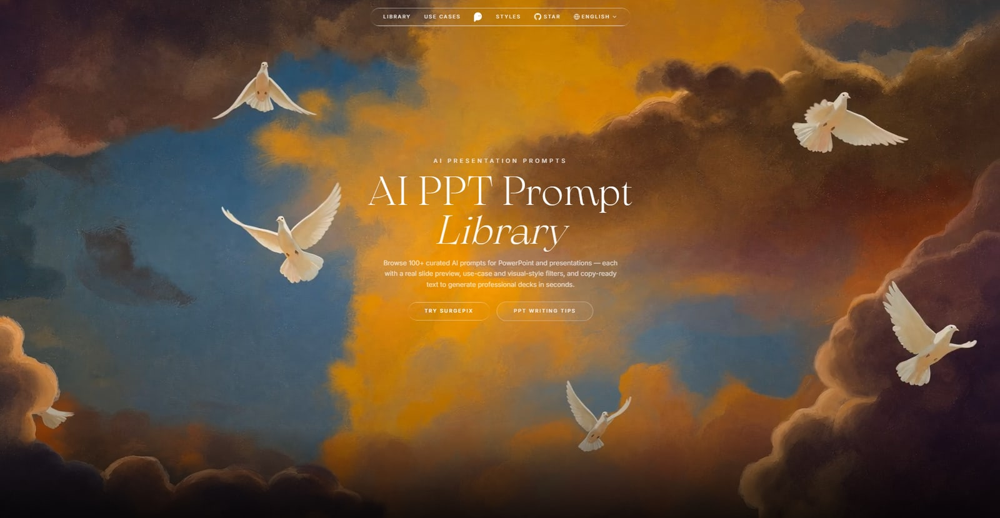
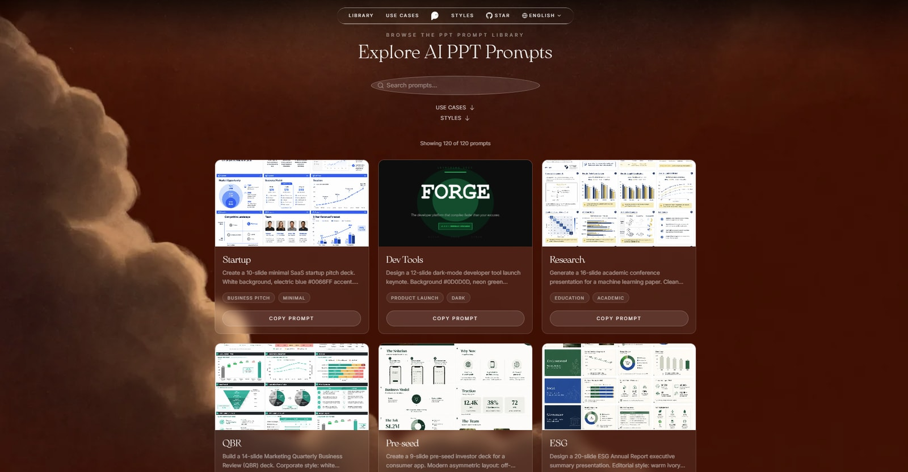

[](README.md) [](README_zh.md) [](README_zh-Hant.md) [](README_ja.md) [](README_ko.md) [](README_th.md) [](README_id.md) [](README_vi.md) [](README_de.md) [](README_fr.md) [](README_es.md) [](README_tr.md) [](README_pl.md)

# 🎨 Awesome AI PPT Prompts

> A curated collection of AI prompts for generating PowerPoint slides and presentations — each with a real slide preview, use-case and style filters, and copy-ready text.

<a href="https://surgepix.ai/resources/awesome-ppt-prompts">
  
</a>

> ⚠️ **Copyright notice**: prompts are collected from the community for educational and inspirational purposes, with source attribution on every entry. If you believe any content infringes on your rights, please [open an issue](https://github.com/SurgePix/ai-ppt-prompts/issues/new) and we will remove it promptly.

---

## 🌐 Browse the interactive gallery

Search across every prompt, filter by use case and visual style, and copy any of them in one click:

<a href="https://surgepix.ai/resources/awesome-ppt-prompts">
  
</a>

**[👉 Browse the interactive gallery →](https://surgepix.ai/resources/awesome-ppt-prompts)**

---

## 📊 Statistics

| | |
|---|---|
| 📝 Total prompts | **120** |
| 🏷️ Use Cases | **11** |
| 🎨 Styles | **16** |
| 🌍 Languages | **13** |

**Use Cases:** Business Pitch · Tech / Product · Product Launch · Education · Marketing · Report / Analysis · Finance · Creative / Design · Business / Strategy · Sales Proposal · Events

**Styles:** Minimal · Modern · Bold · Dark · Tech · Academic · Data Visualization · Corporate · Warm · Editorial · Brand Launch · Technical · Playful · Elegant · Retro · Calm

---

## 📋 All Prompts

### 1. Startup


**Use case:** Business Pitch · Tech / Product · **Style:** Minimal · Modern · Bold

```text
Create a 10-slide minimal SaaS startup pitch deck. White background, electric blue #0066FF accent. Slide 1: bold product name + one-line tagline, logo placeholder top-left. Slide 2: Problem — 3 pain points with thin line icons. Slide 3: Solution — UI mockup placeholder, 3 labeled callouts. Slide 4: Market Opportunity — TAM/SAM/SOM nested circles with $ values. Slide 5: Business Model — 3-column pricing table, recommended tier highlighted with a badge. Slide 6: Traction — MoM active users line chart, milestone markers. Slide 7: Competitive Landscape — 2×2 positioning matrix vs 4 named competitors. Slide 8: Team — 4 headshot cards, name/title/one-line bio. Slide 9: 3-Year Revenue Forecast — grouped bar chart, CAGR annotation. Slide 10: Close — full-bleed CTA, funding ask amount, contact email. Font: Inter throughout. Consistent header bar with logo + slide number on every slide. Tone: confident, data-driven, investor-ready.
```

---

### 2. Dev Tools


**Use case:** Product Launch · Tech / Product · **Style:** Dark · Tech · Bold

```text
Design a 12-slide dark-mode developer tool launch keynote. Background #0D0D0D, neon green #00FF87 accent. Slide 1: full-bleed hero, product name in JetBrains Mono. Slide 2: Problem — terminal-style error messages as bullet points with red # markers. Slide 3: Product reveal — large screenshot with glowing border and subtle particle effect placeholder. Slides 4-7: four feature slides, alternating code-snippet left / result screenshot right layout. Slide 8: Architecture diagram — dark nodes, luminous connecting arrows, system labels in monospace. Slide 9: Benchmark bar chart — dark bg, green bars vs grey competitor bars. Slide 10: Pricing — 3 dark tier cards, Pro highlighted. Slide 11: GitHub star + Discord join CTA. Slide 12: Launch date countdown closer, full-screen gradient. Font: JetBrains Mono for code elements, Inter for prose. Tone: authoritative, technical, exciting.
```

---

### 3. Research


**Use case:** Education · Tech / Product · **Style:** Academic · Minimal · Data Visualization

```text
Generate a 16-slide academic conference presentation for a machine learning paper. Clean white background, university navy #003087 + gold #C9A84C accents. Include: (1) Title, authors, affiliations, venue logo. (2) Motivation — why this problem matters, with a compelling statistic. (3) Related Work — timeline comparison table. (4) Our Approach — methodology flowchart with 4 numbered stages. (5) Theoretical Framework — key equations in a clean LaTeX-style typeset box. (6-9) Results slides with bar charts, line plots, and confusion matrix, each with a highlighted key finding callout. (10) Ablation Study — horizontal grouped bar chart. (11) Qualitative Examples — 2×3 image grid with captions. (12) Limitations. (13) Future Work — 3 bullet roadmap. (14) Conclusion — 4 takeaway bullets. (15) Acknowledgements. (16) Q&A closer. Font: Source Serif Pro headings, Source Sans Pro body. Tone: rigorous, scholarly.
```

---

### 4. QBR


**Use case:** Marketing · Report / Analysis · **Style:** Corporate · Data Visualization · Bold

```text
Build a 14-slide Marketing Quarterly Business Review (QBR) deck. Corporate style: white background, bold teal #00BFA5 accents, dark grey header bars. Slide 1: Executive Summary — 6-KPI dashboard cards (MQL, SQL, CAC, LTV, Revenue, NPS). Slide 2: Channel Performance — heat map table, red/amber/green coding. Slide 3: Campaign ROI table sortable by spend. Slide 4: SEO & Organic Traffic — waterfall chart showing channel contributions. Slide 5: Social Media Engagement — dual-axis trend chart (reach vs. engagement rate). Slide 6: Paid Ads — ROAS by channel stacked horizontal bar. Slide 7: Email Funnel — conversion funnel diagram. Slide 8: Competitive Share-of-Voice — pie chart comparison. Slide 9: Wins & Learnings — 2-column table. Slides 10-11: Next Quarter OKRs with quarterly milestone timeline. Slide 12: Budget Request — waterfall bar. Slide 13: Team Highlights. Slide 14: Appendix placeholder. Font: Helvetica Neue. Tone: data-driven, executive-ready.
```

---

### 5. Pre-seed


**Use case:** Business Pitch · **Style:** Modern · Warm · Bold

```text
Create a 9-slide pre-seed investor deck for a consumer app. Modern asymmetric layout: off-white #FAF9F6 background, deep forest green #1A3C2D accent. Slide 1: Full-bleed lifestyle hero image placeholder + tagline overlay. Slide 2: The Problem — relatable 30-word user story quote with large typography. Slide 3: Solution — 3-step user journey with phone mockup placeholders. Slide 4: Why Now — market timing slide with 3 macro trend icons + one-liner each. Slide 5: Business Model — single illustrated revenue stream diagram. Slide 6: Traction — key metrics in large-number cards (DAU, retention, NPS). Slide 7: The Ask — funding amount, use of funds donut chart, 12-month milestone timeline. Slide 8: Team — founder photos, 2-sentence bios, notable logos. Slide 9: Vision — inspirational closer with brand manifesto quote. Font: DM Serif Display headings, DM Sans body. Tone: warm, human, compelling.
```

---

### 6. ESG


**Use case:** Report / Analysis · Finance · **Style:** Editorial · Warm · Data Visualization

```text
Design a 20-slide ESG Annual Report executive summary presentation. Editorial style: warm ivory #FDFBF5 background, dark charcoal #1C1C1C text, forest green #2D6A4F and ocean blue #1565C0 for section dividers. Cover: company name, 'Sustainability Report 2024', hero landscape photo placeholder. Section dividers (3 total) for Environmental, Social, Governance. Environmental: carbon emissions line chart, energy mix donut, water usage bar. Social: employee diversity stacked bar, safety metrics KPIs, community impact infographic. Governance: board composition chart, ethics policy summary table. Highlights reel: 6 achievement cards with icons and numbers. Awards & certifications logos grid. Forward-looking targets timeline (2024–2030). Back cover: contact details. Fonts: Garamond headings, Gill Sans body. Print-quality with 10mm margin guidelines. Tone: transparent, accountable, optimistic.
```

---

### 7. Brand


**Use case:** Creative / Design · Marketing · **Style:** Bold · Modern · Brand Launch

```text
Create a 15-slide brand identity guidelines deck. Vibrant style with a gradient cover (#FF6B6B → #4ECDC4). Each section has a strong color-block header. Sections: Brand Story (mission, vision, values cards); Logo Usage (correct vs incorrect usage examples grid); Color Palette (primary + secondary + neutral swatches with hex, RGB, CMYK codes); Typography (heading/body/accent type specimens with size scale); Iconography (icon set sample grid); Photography Style (mood board placeholder, do/don't examples); Illustration Style (placeholder); Brand Voice (tone adjectives wheel, writing examples); Social Media Templates (Instagram, LinkedIn, Twitter mockup placeholders); Merchandise mockups (tote bag, business card, mug placeholder); Co-branding rules; Brand in Motion (animation principles, easing guide); Digital UI snippet; Misuse examples gallery; Contact + Download links. Font: the brand's own typeface or Söhne. Tone: confident, inspiring, systematic.
```

---

### 8. Growth


**Use case:** Marketing · Business / Strategy · **Style:** Minimal · Modern · Data Visualization

```text
Build a 12-slide growth marketing playbook presentation. Minimal style: white background, coral #FF4F4F accent, generous whitespace. Slide 1: title + subtitle 'From 0 to 100K Users'. Slide 2: The AARRR Funnel — illustrated funnel diagram with metric at each stage. Slide 3: ICP Definition — persona card with photo placeholder, demographics, pain points, goals. Slide 4: Channel Prioritization Matrix — effort vs. impact scatter plot with labeled channel bubbles. Slide 5: SEO Playbook — keyword strategy pyramid. Slide 6: Paid Acquisition — ad creative anatomy diagram. Slide 7: Referral Program Design — loop diagram. Slide 8: Email Nurture Sequence — horizontal timeline flow. Slide 9: Conversion Rate Optimization — before/after landing page annotated comparison. Slide 10: Analytics Stack — tool logos grid with data flow arrows. Slide 11: 90-Day Experiment Roadmap — Gantt-style timeline. Slide 12: Key Metrics Dashboard — 8 KPI cards with targets. Font: Inter. Tone: strategic, actionable, data-backed.
```

---

### 9. Roadmap


**Use case:** Tech / Product · Business / Strategy · **Style:** Modern · Dark · Technical

```text
Generate a 13-slide product roadmap presentation for a mobile app. Modern style: deep navy #0B1E3D background with white text, cyan #00D4FF accent highlights. Slide 1: Vision statement — bold one-sentence manifesto. Slide 2: 2024 Achievements recap — 4 milestone cards with icons and dates. Slide 3: Strategic Pillars — 3 column icons with one-liner each. Slide 4: H1 2025 Roadmap — horizontal swim-lane timeline by product area. Slide 5: Feature Deep-dive #1 — problem/solution/impact layout. Slides 6-7: Two more feature deep-dives. Slide 8: Platform bets — mobile vs web vs API investment allocation donut. Slide 9: Dependency Map — linked node diagram. Slide 10: OKRs by Quarter — 2×4 grid with RAG status. Slide 11: Tech Debt Plan — stacked bar showing % allocation per sprint. Slide 12: Team Headcount Plan — current vs. planned org chart. Slide 13: How to Give Feedback — channels + calendar invite placeholder. Font: Space Grotesk. Tone: transparent, strategic, execution-focused.
```

---

### 10. University


**Use case:** Education · **Style:** Academic · Warm · Playful

```text
Create a 10-slide introductory course slides for a university computer science module. Friendly academic style: soft blue #EEF4FF background, warm navy #1A237E headings, yellow #FFC107 highlights. Slide 1: Course title, instructor name, photo placeholder, semester info. Slide 2: Why This Course Matters — real-world applications with 3 photo placeholders. Slide 3: Learning Objectives — numbered list with checkmark icons. Slide 4: Weekly Schedule — colorful table overview of topics. Slide 5: Assessment Breakdown — donut chart of grade weightings. Slide 6: Resources — textbook cover placeholder, online tools logos. Slide 7: How Office Hours Work — visual schedule calendar. Slide 8: Academic Integrity Policy — dos/don'ts two-column table. Slide 9: First Week Assignment — step-by-step card layout. Slide 10: Q&A + contact details. Font: Nunito for headings, Open Sans for body. Tone: welcoming, clear, encouraging.
```

---

### 11. B2B


**Use case:** Sales Proposal · Business / Strategy · **Style:** Corporate · Modern · Bold

```text
Design a 10-slide B2B sales discovery and pitch deck. Corporate professional style: white + dark slate #1E293B + vibrant orange #F97316. Slide 1: Account name personalization slot + your company logo. Slide 2: We Heard You — mirror back the prospect's 3 stated pain points in their own language. Slide 3: Why Companies Like Yours Choose Us — 3 logos + one-sentence outcome each. Slide 4: Our Solution — value proposition in one sentence, 4 benefit icons below. Slide 5: How It Works — 3-step illustrated process. Slide 6: Case Study — metrics before/after comparison cards. Slide 7: ROI Calculator — simple input table with output highlight box. Slide 8: Implementation Timeline — 4-phase Gantt. Slide 9: Pricing Overview — simplified tier table (detailed in appendix). Slide 10: Next Steps — 3 clear action items with owner/date/emoji. Font: Inter. Tone: consultative, prospect-centric, action-oriented.
```

---

### 12. Series B


**Use case:** Finance · Business / Strategy · **Style:** Minimal · Corporate · Data Visualization

```text
Build a 12-slide Series B investor update board deck. Ultra-minimal executive style: white background, thin black divider lines, single accent color — emerald #059669. Slide 1: Company name, Series B progress bar (raised vs. target), date. Slide 2: One-Page Business Summary — 6-cell grid covering product, market, model, traction, team, ask. Slide 3: KPI Dashboard — 8 large-number cards vs. last month and vs. plan. Slide 4: Revenue Waterfall — new / expansion / churn / net new MRR. Slide 5: Unit Economics — CAC, LTV, LTV:CAC, payback period in 2×2 metric cards. Slide 6: Sales Pipeline — funnel with conversion rates at each stage. Slide 7: Product Highlights — top 3 shipped features with impact metric. Slide 8: Competitive Win/Loss Analysis — bar chart by reason. Slide 9: Headcount — current org chart, open roles highlighted. Slide 10: Burn & Runway — monthly burn line chart, runway callout box. Slide 11: Risks & Mitigations — 2-column table. Slide 12: The Ask — use of funds allocation and 18-month milestone plan. Font: Inter. Tone: transparent, rigorous, investor-grade.
```

---

### 13. Architecture


**Use case:** Tech / Product · Education · **Style:** Dark · Technical · Data Visualization

```text
Create a 14-slide cloud-native microservices architecture deep-dive for a technical audience. Dark theme: #0A0E17 background, electric blue #3B82F6 and green #22C55E highlights, white text. Slide 1: Title + audience level indicator (Advanced). Slide 2: System Design Goals — CAP theorem recap, target SLAs table. Slide 3: High-Level Architecture Diagram — service boxes with labeled API gateways, message queues, databases, CDN. Slides 4-7: Four service deep-dives — each shows service interface contract, data model, key design decisions, latency budget. Slide 8: Event-Driven Communication — Kafka topic flow diagram. Slide 9: Observability Stack — metrics/logging/tracing three-pillar diagram with tool logos. Slide 10: Security Perimeter — mTLS, OAuth2, secrets management illustrated. Slide 11: Deployment Pipeline — CI/CD flow diagram with GitHub Actions stages. Slide 12: Failure Mode Analysis — runbook table. Slide 13: Performance Benchmarks — p50/p95/p99 latency bar charts. Slide 14: Future Roadmap — 3 architectural evolution phases. Font: JetBrains Mono + Inter. Tone: detailed, precise, engineering-grade.
```

---

### 14. TED


**Use case:** Events · Creative / Design · **Style:** Bold · Editorial · Dark

```text
Generate a 18-slide TED-style inspirational keynote presentation. Bold editorial design: black background #111111, single vivid accent color that changes per section (coral → gold → teal), giant typographic headlines. Opening: full-screen quote in 72pt white text. Problem framing: 4 slides with one arresting statistic per slide — huge number, small context text. Story arc: 3 slides for a personal narrative with photo placeholders. The Idea: 2 slides explaining the core insight in plain language. Evidence: 3 data slides — one chart each, labeled simply. Call to Action: 2 slides — the shift required, and 3 things the audience can do today. Closing: memorable one-sentence manifesto + speaker photo + social handles. No bullet points anywhere. Every slide communicates ONE idea. Font: Obviously or Druk for display, GT America for body. Tone: urgent, emotional, memorable.
```

---

### 15. Market Research


**Use case:** Report / Analysis · Business / Strategy · **Style:** Corporate · Data Visualization · Modern

```text
Create a 16-slide market research report presentation. Clean corporate style: white background, professional blue #0047AB, 12px grid layout. Slide 1: Report title, date, research methodology badge. Slide 2: Executive Summary — 4 key findings in large callout boxes. Slide 3: Research Methodology — survey sample, timeline, data sources table. Slide 4: Market Overview — total market size + CAGR chart. Slide 5: Market Segmentation — donut chart + description table. Slide 6: Growth Drivers — horizontal bar chart ranked by impact. Slide 7: Market Challenges — risk matrix 2×2. Slide 8: Competitive Landscape — bubble chart (market share vs. growth rate, bubble = revenue). Slide 9: Competitor Profiles — 4 mini-profile cards. Slide 10: Consumer Behavior Survey — bar chart top findings. Slide 11: Buying Journey Map — horizontal stage diagram with channel labels. Slide 12: Emerging Trends — 4 trend cards with 3-year projection sparklines. Slide 13: Regulatory Environment — summary table. Slide 14: Opportunities by Region — world heat map. Slide 15: Strategic Recommendations — numbered action list. Slide 16: Appendix — methodology detail, raw data tables. Font: Calibri headings, Arial body. Tone: objective, analytical, evidence-based.
```

---

### 16. Onboarding


**Use case:** Education · Events · **Style:** Warm · Playful

```text
Build a 12-slide new employee onboarding deck. Warm and welcoming style: off-white #FFFEF7 background, warm teal #0D9488 + sunny yellow #FCD34D accents. Slide 1: Welcome message from CEO with photo placeholder and personal quote. Slide 2: Our Mission & Values — 4 value cards with icons and one-line descriptions. Slide 3: Company Milestones — illustrated horizontal timeline from founding to today. Slide 4: Meet Your Team — org chart section with headshots placeholder, showing new hire's position highlighted. Slide 5: Your First Week Schedule — day-by-day calendar card layout. Slide 6: Tools & Systems Setup Checklist — icon grid with checkboxes. Slide 7: How We Work — working norms (async-first, feedback culture) as a visual card set. Slide 8: Benefits Overview — 6 benefit category icons with one-line summary each. Slide 9: Learning Resources — 4 resource cards with QR placeholders. Slide 10: DEI & ERGs — group logos and join links. Slide 11: Key Contacts Directory — role-based contact cards. Slide 12: Your 30-60-90 Day Goals — tabbed milestone plan. Font: Nunito. Tone: warm, human, energizing.
```

---

### 17. Earnings


**Use case:** Finance · Report / Analysis · **Style:** Corporate · Data Visualization · Elegant

```text
Design a 14-slide Q1 2025 financial earnings results presentation for a public company. Formal corporate style: white background, deep navy #001F5B primary, gold #C8A951 accent. Slide 1: Quarter summary title, fiscal date, safe harbor statement. Slide 2: Q1 Highlights — 5 headline metrics in large number cards (Revenue, EPS, Gross Margin, FCF, Guidance). Slide 3: Revenue Bridge — waterfall chart from Q4 2024 to Q1 2025. Slide 4: Revenue by Segment — horizontal stacked bar with prior year comparison. Slide 5: Gross Margin Trend — dual-axis line+bar chart over 8 quarters. Slide 6: Operating Expenses — grouped bar chart by category. Slide 7: EBITDA Walk — waterfall chart. Slide 8: Cash Flow Statement Summary — 3-column table. Slide 9: Balance Sheet Highlights — asset/liability card summary. Slide 10: Geographic Revenue Split — regional pie chart + table. Slide 11: Customer Metrics — ARR, NRR, logo count trend charts. Slide 12: Q2 2025 Guidance — range table with consensus vs. guidance. Slide 13: Full-Year Outlook — updated annual guidance table. Slide 14: Appendix — reconciliation tables, non-GAAP definitions. Font: Times New Roman headings, Calibri body. Tone: precise, compliance-minded, investor-grade.
```

---

### 18. Design System


**Use case:** Tech / Product · Report / Analysis · **Style:** Minimal · Technical · Modern

```text
Create a 14-slide design system review and proposal presentation. Ultra-minimal design: pure white #FFFFFF background, 8px grid, jet black #111111 text, single electric purple #7C3AED accent for key elements. Slide 1: Design System name, version, team, date. Slide 2: Current State Audit — component inventory heat map showing coverage vs. gaps. Slide 3: Pain Points — developer survey results bar chart, top 5 complaints. Slide 4: Proposed Improvements — before/after component comparison grid (old vs. new). Slide 5: New Component Library Overview — categorized component thumbnail grid. Slide 6: Token System — color/spacing/typography token naming convention diagrams. Slide 7: Accessibility Upgrades — contrast ratio table, WCAG 2.2 AA compliance checklist. Slide 8: Motion & Animation Principles — easing curve examples with frame previews. Slide 9: Dark Mode Implementation — side-by-side light/dark component comparison. Slide 10: Documentation Site — screenshot mockup. Slide 11: Migration Guide — step-by-step numbered process. Slide 12: Adoption Roadmap — phased quarterly plan. Slide 13: Team Buy-in — stakeholder map + sign-off checklist. Slide 14: Success Metrics — KPIs for adoption tracking. Font: Inter. Tone: precise, collaborative, forward-looking.
```

---

### 19. Case Study


**Use case:** Marketing · Sales Proposal · **Style:** Warm · Elegant · Editorial

```text
Build a 10-slide customer success story / case study presentation. Narrative storytelling style: warm white background, brand color of the featured customer, large pull quotes in 48pt type. Slide 1: Customer logo + headline result in one sentence ('How [Company] 3× revenue in 6 months'). Slide 2: Meet the Customer — company profile card, industry, size, key challenge. Slide 3: The Challenge — customer's words as a large testimonial quote, plus 3 pain points. Slide 4: Why They Chose Us — decision criteria table, competitive alternatives considered. Slide 5: The Solution — product areas used, implementation timeline. Slide 6: Results — 3 metric cards with before/after numbers and % improvement. Slide 7: Impact Deep-dive — supporting chart (revenue, time saved, etc.). Slide 8: Team Quote — full-page quote from their VP/Director with headshot. Slide 9: What's Next — customer's expansion plan and future goals. Slide 10: Your Turn — CTA to book a demo, contact details, next step button. Font: Georgia headings, Inter body. Tone: authentic, outcome-focused, persuasive.
```

---

### 20. Board Deck


**Use case:** Business / Strategy · Finance · **Style:** Minimal · Corporate

```text
Design a 12-slide monthly board packet update presentation. Executive minimalist style: clean white, slate grey #475569 secondary, accent dot indicators in red/amber/green for status. Slide 1: Month/Year, company name, key metrics banner (3 large KPI numbers). Slide 2: CEO Summary — three bullet narrative: what went well, what didn't, what we're doing about it. Slide 3: Revenue Dashboard — actuals vs. plan bar chart + trend line, variance commentary box. Slide 4: Customer Metrics — NRR, churn rate, logo count vs. last month + plan. Slide 5: Product Velocity — shipped items table with business impact tags. Slide 6: Sales Pipeline — stage-by-stage funnel chart, weighted vs. unweighted. Slide 7: Burn Rate & Runway — monthly bar chart + months of runway callout. Slide 8: People — headcount table, open roles, attrition rate. Slide 9: Strategic Initiative Status — 5-row RAG status table. Slide 10: Risks & Issues — risk register top 5 with owner and ETA. Slide 11: Board Decision Required — clearly highlighted item with two-option framing. Slide 12: Appendix — detailed financial tables, cohort data. Font: Inter. Tone: concise, transparent, decision-facilitating.
```

---

### 21. Leadership


**Use case:** Education · **Style:** Modern · Corporate · Bold

```text
Create a 14-slide corporate leadership training workshop presentation. Energetic modern style: gradient section headers (dark blue → purple), white content areas, large workshop activity icons. Slide 1: Workshop title, facilitator name, agenda overview timeline. Slide 2: Learning Objectives — 4 skill outcome cards with icons. Slides 3-4: Module 1 — Adaptive Leadership (theory overview, then interactive discussion prompt). Slides 5-6: Module 2 — Psychological Safety (research summary chart, team exercise instructions). Slides 7-8: Module 3 — Feedback Culture (SBI model diagram, role-play scenario cards). Slide 9: Reflection Activity — individual journaling prompt with timer graphic. Slide 10: Group Discussion Template — table format for capturing team norms. Slide 11: Key Takeaways — top 5 principles illustrated as icons with one-liners. Slide 12: 30-Day Action Plan template — personal commitment worksheet. Slide 13: Resources — book covers, article QR codes. Slide 14: Evaluation & Feedback QR code. Font: Raleway headings, Open Sans body. Tone: energizing, practical, participatory.
```

---

### 22. GTM


**Use case:** Product Launch · Business / Strategy · **Style:** Dark · Modern · Bold

```text
Build a 15-slide go-to-market (GTM) strategy presentation for a new product launch. Strategic style: dark charcoal #1C1C2E background, vibrant gradient accents, white text. Slide 1: Product name + GTM mission statement. Slide 2: Target Market — ICP definition table (firmographics + psychographics + technographics). Slide 3: Total Addressable Market — top-down and bottoms-up TAM/SAM/SOM comparison. Slide 4: Competitive Positioning — perceptual map with 6 competitors plotted. Slide 5: Value Proposition Canvas — customer jobs/pains/gains vs. product gains/pain relievers. Slide 6: Pricing Strategy — price positioning chart, tier rationale. Slide 7: Channel Strategy — direct vs. partner vs. self-serve allocation waterfall. Slide 8: Launch Phases — 3-phase horizontal timeline (Pre-launch, Launch, Post-launch) with milestones. Slide 9: Content & Demand Gen Plan — channel mix table with budget allocation. Slide 10: Sales Motion — land-and-expand diagram. Slide 11: Partner Ecosystem — partner type matrix. Slide 12: Success Metrics by Phase — KPI table per launch phase. Slide 13: Budget Overview — spend breakdown by function. Slide 14: Team RACI — responsibilities matrix. Slide 15: Risk Register — top 5 risks with mitigation. Font: Syne headings, Inter body. Tone: strategic, ambitious, cross-functional.
```

---

### 23. Microservices


**Use case:** Tech / Product · Education · **Style:** Dark · Technical · Data Visualization

```text
Generate a 16-slide technical deep-dive on migrating from monolith to microservices for senior engineers. Dark professional theme: #0F172A background, Tailwind-blue accent #38BDF8. Slide 1: Title + prerequisites (experience level badge). Slide 2: Monolith Pain Points — deployment coupling diagram, scale bottlenecks heatmap. Slide 3: Migration Strategies Overview — Big Bang vs. Strangler Fig vs. Branch by Abstraction comparison table. Slide 4: The Strangler Fig Pattern — step-by-step annotated diagram. Slide 5: Service Boundary Identification — DDD bounded context mapping diagram. Slide 6: API Contract Design — OpenAPI spec snippet, versioning strategy. Slide 7: Database Decomposition — shared DB → per-service DB migration phases. Slide 8: Saga Pattern for Distributed Transactions — choreography vs. orchestration comparison. Slide 9: Service Mesh Introduction — sidecar proxy diagram. Slide 10: Observability Requirements — distributed tracing flow with Jaeger example. Slide 11: Testing Strategy — test pyramid adapted for microservices, contract testing highlighted. Slide 12: CI/CD Pipeline Changes — monorepo vs. polyrepo pipeline comparison. Slide 13: Canary Deployment Strategy — traffic split diagram. Slide 14: Common Pitfalls — 6 anti-patterns with code smell examples. Slide 15: Migration Checklist — phased readiness checklist table. Slide 16: Q&A + further reading QR codes. Font: Fira Code + Inter. Tone: technical, pragmatic, battle-tested.
```

---

### 24. Performance Review


**Use case:** Report / Analysis · Business / Strategy · **Style:** Corporate · Minimal · Data Visualization

```text
Create a 10-slide annual performance review presentation template for managers. Clean professional style: white background, subtle grey sidebar, teal #0891B2 accents. Slide 1: Employee name (placeholder), role, review period, manager name. Slide 2: Role Expectations Overview — original job description key responsibilities in a table. Slide 3: Goal Achievement Review — goals set vs. results achieved table with RAG status and % complete. Slide 4: Competency Assessment — radar chart covering 6 core competencies with self-score vs. manager-score overlay. Slide 5: Key Accomplishments — 3 featured achievement cards with impact metric. Slide 6: Areas for Development — 2-column table: skill gap + recommended action. Slide 7: 360 Feedback Summary — anonymized theme cards from peers and reports (verbatim quotes in quote boxes). Slide 8: Compensation & Level Change Decision — current vs. proposed comp table with rationale. Slide 9: Goals for Next Year — SMART goal template table (3 rows). Slide 10: Career Development Plan — 12-month learning roadmap with milestones. Font: Inter. Tone: fair, constructive, growth-oriented.
```

---

### 25. AI Trends


**Use case:** Report / Analysis · Tech / Product · **Style:** Editorial · Dark · Data Visualization

```text
Design a 20-slide 'State of AI in 2025' trend report presentation. Editorial magazine style: rich black #0C0C0C background, white text, gold #E9B96E data highlights, full-bleed section cover slides. Cover: oversized typography, 'STATE OF AI 2025', subtitle, publisher logo. Section 1 — Foundation Models (4 slides): model landscape timeline, capability benchmark radar chart, cost-per-token trend line, open vs. closed model market share. Section 2 — Enterprise Adoption (4 slides): adoption rate by industry heat map, ROI survey results bar chart, implementation barriers ranking, top use case leaderboard. Section 3 — Workforce Impact (4 slides): job augmentation vs. displacement research summary, skills gap analysis, training investment trends, new AI-native role taxonomy. Section 4 — Regulation & Safety (3 slides): global regulation tracker map, safety incident database chart, red-teaming maturity model. Section 5 — What's Next (3 slides): 3 expert predictions with confidence scores, technology readiness levels, '5 things to do in 2025' action list. Back cover: methodology, citations. Font: Editorial New Display + Neue Haas Grotesk. Tone: authoritative, insightful, forward-looking.
```

---

### 26. Acid Graphics Y2K (酸性设计)


**Use case:** Creative / Design · **Style:** Retro · Bold · **Source:** [AAAAAAAJ](https://github.com/AAAAAAAJ/slides/blob/e9d5f3f3290af9e50ca3aa18eed176b9a6c02978/PROMPTS.md)

```text
Acid graphics Y2K style PPT slide, Light gray background, title text, subtitle below, key stats in stylized cards, Metallic chrome elements, holographic accents, Colors: purple #B185FF, pink #FF6EC7, mint #7BFFCB, gold #FFD700, Liquid shapes, star sparkles, mesh gradients, Y2K aesthetic, futuristic design, 16:9
```

---

### 27. Swiss International (瑞士国际主义)


**Use case:** Creative / Design · **Style:** Bold · Retro · Modern · **Source:** [AAAAAAAJ](https://github.com/AAAAAAAJ/slides/blob/e9d5f3f3290af9e50ca3aa18eed176b9a6c02978/PROMPTS.md)

```text
Swiss international style PPT slide, brutalist graphic design, Light gray background, bold title text, subtitle with diagonal layout, key stats in geometric blocks, High saturation colors: blue #007AFF, green #00994D, yellow #FFF066, purple #9966FF, pink #FF3399, orange #FF8800, Helvetica font, Asymmetric composition, 16:9
```

---

### 28. Neo-Brutalism (新粗野主义)


**Use case:** Creative / Design · **Style:** Bold · Retro · **Source:** [AAAAAAAJ](https://github.com/AAAAAAAJ/slides/blob/e9d5f3f3290af9e50ca3aa18eed176b9a6c02978/PROMPTS.md)

```text
Neo-brutalism style PPT slide, raw design, Cream background, bold title text, subtitle below, key stats displayed, Bold primary colors: red #FF4D4D, blue #4D94FF, yellow #FFD93D, Thick 4px black outlines, hard shadows, Brutalist frames, bold typography, Stark contrast, 16:9
```

---

### 29. Minimalist Clean (极简主义)


**Use case:** Business / Strategy · Report / Analysis · **Style:** Minimal · Corporate · Elegant · **Source:** [AAAAAAAJ](https://github.com/AAAAAAAJ/slides/blob/e9d5f3f3290af9e50ca3aa18eed176b9a6c02978/PROMPTS.md)

```text
Minimalist clean design PPT slide, White background, generous whitespace, centered title text, subtitle below, key stats in simple cards, Subtle gray and blue accents, Thin elegant lines, Inter Helvetica font, Professional corporate presentation, Simple elegant layout, 16:9
```

---

### 30. Claymorphism (黏土拟态)


**Use case:** Creative / Design · Marketing · **Style:** Playful · Bold · **Source:** [AAAAAAAJ](https://github.com/AAAAAAAJ/slides/blob/e9d5f3f3290af9e50ca3aa18eed176b9a6c02978/PROMPTS.md)

```text
Claymorphism style PPT slide, soft chunky 3D clay interface, thick toy-like rounded cards, inflated pill buttons, tactile depth with bright top-left inner highlights and soft bottom-right shadows, creamy warm background, bold title text, subtitle below, 3 to 5 key statistics in colorful chunky cards, candy palette with coral #FF7A59, sky blue #6EC5FF, lemon yellow #FFD85E, mint #7EE2B8, lavender #B79CFF, bubbly icons, smooth plastic texture, friendly high-contrast presentation design, clean single-slide composition, 16:9
```

---

### 31. Design Blueprint (设计蓝图)


**Use case:** Tech / Product · Creative / Design · **Style:** Technical · Minimal · Modern · **Source:** [AAAAAAAJ](https://github.com/AAAAAAAJ/slides/blob/e9d5f3f3290af9e50ca3aa18eed176b9a6c02978/PROMPTS.md)

```text
Design blueprint PPT slide, Figma documentation style, White background with cyan grid lines #66B8CC, title text, subtitle below, Figma selection boxes with control points, Annotation lines, numbered labels, Technical UI mockup aesthetic, Clean sans-serif Inter font, 16:9
```

---

### 32. Cyberpunk Neon (赛博朋克)


**Use case:** Tech / Product · Creative / Design · **Style:** Dark · Tech · Bold · **Source:** [AAAAAAAJ](https://github.com/AAAAAAAJ/slides/blob/e9d5f3f3290af9e50ca3aa18eed176b9a6c02978/PROMPTS.md)

```text
Cyberpunk neon style PPT slide, Dark charcoal background, title text with neon glow effect, subtitle below, Neon colors: magenta #FF00FF, cyan #00FFFF, yellow #FFFF00, Tech grid patterns, circuit decorations, Holographic data panels, glow effects, Futuristic UI elements, Digital presentation, 16:9
```

---

### 33. Modern Minimal Pop (现代极简波普)


**Use case:** Creative / Design · Marketing · **Style:** Minimal · Playful · Modern · **Source:** [AAAAAAAJ](https://github.com/AAAAAAAJ/slides/blob/e9d5f3f3290af9e50ca3aa18eed176b9a6c02978/PROMPTS.md)

```text
Modern minimal pop art PPT slide, Instagram aesthetic, Pastel background, title text, subtitle below, key stats displayed, Pastel colors: mint #A8E6C8, cream #FFF4BD, coral #FF8B7A, purple #8B7AFF, Star burst graphics, thin line circles, Tilted color blocks, small arrows, Clean sans-serif typography, Swiss design influence, 16:9
```

---

### 34. Retro Pop Art (复古波普)


**Use case:** Creative / Design · Marketing · **Style:** Retro · Bold · Playful · **Source:** [AAAAAAAJ](https://github.com/AAAAAAAJ/slides/blob/e9d5f3f3290af9e50ca3aa18eed176b9a6c02978/PROMPTS.md)

```text
Retro pop art style PPT slide, 1970s magazine aesthetic, flat design with thick black outlines, cream beige background, bold title text, subtitle below, key statistics displayed as cards, Salmon pink #FF6B6B, sky blue #4ECDC4, mustard yellow #FFD93D, mint green #6BCB77 accents, Geometric decorations: quarter circles, concentric rings, star bursts, Bold sans-serif typography, Professional presentation design, 16:9
```

---

### 35. Scrapbook DIY Vibe (剪贴板手作风格)


**Use case:** Creative / Design · Marketing · **Style:** Playful · Bold · Editorial · **Source:** [AAAAAAAJ](https://github.com/AAAAAAAJ/slides/blob/e9d5f3f3290af9e50ca3aa18eed176b9a6c02978/PROMPTS.md)

```text
Scrapbook DIY vibe PPT slide, poster-like handmade collage composition, off-white paper board background with subtle paper grain, hand-cut paper blocks with torn edges, transparent tape corners, sticker badges, doodled arrows, handwritten marker notes, layered polaroid-style photo cutouts, bold title on a pasted headline card, subtitle below on a small note strip, 3 to 5 key stats shown as clipped paper labels, saturated youth accents: tomato orange #FF7A59, butter yellow #FFD766, sky blue #6EC5FF, grass green #72D572, hot pink #FF5FA2, anti-grid layout, messy but readable hierarchy, social app launch poster energy, authentic DIY mood, bold sans-serif typography mixed with handwritten highlights, creative editorial presentation design, 16:9
```

---

### 36. Neo-Brutalist UI (粗野主义 UI)


**Use case:** Tech / Product · Creative / Design · **Style:** Bold · Retro · **Source:** [AAAAAAAJ](https://github.com/AAAAAAAJ/slides/blob/e9d5f3f3290af9e50ca3aa18eed176b9a6c02978/PROMPTS.md)

```text
Neo-brutalist UI PPT slide, dashboard interface design, Cream background, title text, subtitle below, stats in cards, Pastel panels: mint #A8E4CF, yellow #FFD93D, lavender #E5B3FF, Thick 3px black outlines, Card-based layout, flat colors, Bold typography, Contemporary SaaS dashboard aesthetic, 16:9
```

---

### 37. Y2K Pixel Retro (Y2K 像素复古)


**Use case:** Creative / Design · **Style:** Retro · Dark · **Source:** [AAAAAAAJ](https://github.com/AAAAAAAJ/slides/blob/e9d5f3f3290af9e50ca3aa18eed176b9a6c02978/PROMPTS.md)

```text
Y2K pixel retro PPT slide, 1990s aesthetic, Dark background with noise texture, title text in pixel font, subtitle below, Bright colors: yellow #FFD700, orange #FF8C00, green #4A7C4E, Pixel art computer icons, CRT monitor graphics, Isometric tech illustrations, VT323 pixel font style, Vintage 1990s design, 16:9
```

---

### 38. Frutiger Aero (乐观科技风)


**Use case:** Tech / Product · Marketing · **Style:** Retro · Bold · Playful · **Source:** [AAAAAAAJ](https://github.com/AAAAAAAJ/slides/blob/e9d5f3f3290af9e50ca3aa18eed176b9a6c02978/PROMPTS.md)

```text
Frutiger Aero style PPT slide, optimistic 2000s tech-utopia aesthetic, glossy translucent glass panels floating over an aqua sky and fresh green field background, bold title text, subtitle below, 3 to 5 key statistics displayed in rounded glossy cards, bright clean colors: aqua blue #7FD8FF, sky cyan #BFEFFF, grass green #7ED957, leaf green #B7F07A, pure white #FFFFFF, soft lens flare, bokeh light circles, water bubbles, gentle wave swooshes, cloudlike highlights, humanist sans-serif typography, polished corporate technology presentation, clean depth, cheerful and futuristic but friendly, Windows Vista Aero and early eco-tech ad mood, 16:9
```

---

### 39. Dark Glassmorphism (暗黑玻璃拟态)


**Use case:** Tech / Product · Report / Analysis · **Style:** Dark · Modern · Elegant · **Source:** [AAAAAAAJ](https://github.com/AAAAAAAJ/slides/blob/e9d5f3f3290af9e50ca3aa18eed176b9a6c02978/PROMPTS.md)

```text
Dark glassmorphism PPT slide, premium AI control-plane aesthetic, deep obsidian background with blurred aurora glow under smoked frosted glass panels, bold title text, subtitle below, 3 to 5 KPI cards in translucent dashboard modules, thin luminous white borders, subtle cyan and violet highlights, soft reflections, layered depth, high-contrast modern sans-serif typography, elegant enterprise SaaS and copilot interface design, cinematic yet clean, 16:9
```

---

### 40. Accenture Style


> Purple, black, and greater than

**Use case:** Business / Strategy · **Style:** Corporate · Bold · **Source:** [SlideSpeak](https://github.com/SlideSpeak/presentation-design-prompts/tree/main/prompts/accenture-style)

```text
Create a presentation in the 'Accenture Style' theme, an unofficial homage to the purple-and-black look of the big technology consultancy. Interior slides are white (#ffffff); covers and section dividers are full-bleed black (#000000). Typography: headlines in 'Archivo' at 700 to 800 weight, sentence case with a lowercase-leaning voice, 44 to 64px, letter-spacing -0.02em, line-height 1.05 to 1.15; body in 'Inter', 15 to 18px near-black (#202020), left-aligned, max width around 60 characters; kicker labels 12 to 13px Archivo 700 in purple (#a100ff), prefixed '> '. Color discipline is absolute: purple #a100ff is the only accent against black, white, and gray #66646e; deep purple #7500c0 and light tint #d2a5ff appear only inside charts. The greater-than sign is the signature motif, a bold text glyph deployed three ways: a giant cropped background > (400 to 700px, #a100ff on black covers, 6 to 8 percent black on white slides, bleeding off the right edge), small purple > markers before list items, and a > prefix on kickers and CTAs. Title slide: black, giant purple >, a thin 2px #a100ff rule above a white Archivo 800 headline, presenter and date in 13px gray-white, wordmark lockup bottom-left ending in >. Agenda: five rows split by 1px #e4e1ea hairlines, each led by an Archivo 800 two-digit numeral (01 to 05). Signature exhibit: oversized stat callouts, numerals 110 to 160px Archivo 800 in #a100ff over a one-line caption and an 11px #66646e source line, three per slide max, split by vertical hairlines. Charts are monochrome purple in series order #a100ff, #7500c0, #000000, #d2a5ff: flat bars, no gridlines, one 1px black baseline, bold direct value labels, headlines that state the takeaway as a full sentence. Framework slides read today > next > greater, flat #f6f4f9 panels (2px radius) joined by 64px purple > glyphs, one panel inverted to solid #a100ff with white text. Footer on every interior slide: 10px #66646e, copyright left, page number right. Closer: black, a massive white statement with the final word in purple, next steps prefixed by purple >. Strictly avoid: any second accent hue (blue, teal, orange, green), purple gradients, glows or glassmorphism, serif or rounded fonts, Title Case or all-caps headlines, chevron icons or arrows in place of a true bold > glyph, rounded cards with drop shadows, lavender or pastel purple page backgrounds, chart legends, gridlines, 3D or donut decoration, full-color stock photography, small timid stat numbers, and claiming affiliation with Accenture.

Use this theme for my slides. Ask me what the presentation is about first, then apply the theme to every slide.
```

---

### 41. Arcade


> Insert coin

**Use case:** Tech / Product · **Style:** Playful · Dark · Retro · **Source:** [SlideSpeak](https://github.com/SlideSpeak/presentation-design-prompts/tree/main/prompts/arcade)

```text
Create a presentation in the 'Arcade' theme, an 8-bit arcade cabinet screen. Background: deep navy black #0D0D1A. Palette: yellow #FFD23F, pink-red #FF4365, cyan #2DE2E6, green #7CFC00 and white. Typography: headlines in 'Press Start 2P' and all other text, including the HUD, in the monospaced 'VT323' (both Google Fonts); uppercase, headlines 36 to 64px in #FFD23F with a hard offset shadow of 5px 5px 0 #FF4365, no blur. Signature motifs: (1) a HUD row at the top of every slide, '1UP 4200' left in #FF4365 and 'HI-SCORE 9999' right in #2DE2E6, scores in white; (2) double-border panels, a 4px solid border, a 3px gap, then an inner 2px border in the same color; (3) bars, icons and charts built from 12px square blocks with 3px gaps like pixel art, including 5x4-grid pixel hearts in #FF4365; (4) a centered 'PRESS START' footer in white at 50 percent opacity. Strictly avoid: gradients, rounded corners, blur or glow effects, photographs, serif fonts, smooth curves.

Use this theme for my slides. Ask me what the presentation is about first, then apply the theme to every slide.
```

---

### 42. Art Deco


> Gold geometry for the modern jazz age

**Use case:** Creative / Design · **Style:** Elegant · Bold · Retro · **Source:** [SlideSpeak](https://github.com/SlideSpeak/presentation-design-prompts/tree/main/prompts/art-deco)

```text
Create a presentation in the 'Art Deco' theme, a 1920s jazz-age deck in deep emerald and flat gold. Background: near-black emerald (#0E1512); content panels sit on #16241F with sharp 90-degree corners and a 1px antique-gold border (#6F5B30) plus a second inset hairline 6px inside it, the signature double-rule deco frame. Typography: slide titles in 'Cinzel', uppercase, letter-spacing 0.14em, champagne (#EFE3C0), always centered, with a centered ornament beneath: a 60px hairline in #6F5B30, an 8px rotated-square gold diamond (#D4AF37), another 60px hairline; kickers and labels in 'Marcellus', uppercase, letter-spacing 0.22em, 11 to 13px, gold; body copy and axis labels in 'Tenor Sans' (#C9C3B0); big numerals in 'Cinzel' gold, agenda numbering in Roman numerals (I to IV). The signature motif is a semicircular sunburst fan built with repeating-conic-gradient(from -90deg, #D4AF37 0deg 1.5deg, transparent 1.5deg 10deg), clipped by border-radius, at 35 to 50 percent opacity, placed symmetrically behind or above title blocks, never as an image. Composition is strictly symmetric everywhere. Title slide: the sunburst rising behind a Cinzel title with a Marcellus gold subtitle, wrapped in the double-rule frame with 12px L-shaped gold corner brackets. Agenda: two symmetric columns of Roman-numbered items separated by 1px #3A3322 hairlines, with a chevron zigzag band (135deg gold repeating-linear-gradient stripes mirrored by a 45deg twin) under the title. KPI slides: four fan-arch stat cards whose top edge is a semicircle arch (border-radius 999px 999px 0 0) filled with the sunburst gradient, metric beneath in Cinzel gold. Charts are flat divs: bars in #D4AF37, then #46A08B, #C25E6A, #ADB5B0, each with a 1px #EFE3C0 top cap, gridlines #3A3322, baseline #6F5B30, value callouts in Cinzel gold. Tables: Marcellus gold headers over a double rule (1px #D4AF37 over 1px #6F5B30), body rows split by #3A3322 hairlines, numerals right-aligned. Frameworks use a stepped ziggurat of 3 to 5 centered #2E2816 blocks with #6F5B30 borders, each wider than the one above. Footer: a full-width #6F5B30 hairline, the deck name in Marcellus uppercase #948E76 flanked by two tiny gold diamonds, page number in Cinzel at far right. Keep gold under 10 percent of any slide. Strictly avoid: Broadway novelty lettering and Gatsby party-invitation scripts; metallic gradients, bevels or shadows on gold; feathers, pearls, champagne glasses, confetti, glitter; rounded corners or pill buttons; asymmetric or ragged-left titles; solid gold backgrounds; pure #000000 or pure #FFFFFF; lowercase display headlines; raster sunburst images or emoji; modern blue or purple accents.

Use this theme for my slides. Ask me what the presentation is about first, then apply the theme to every slide.
```

---

### 43. Atelier


> Built like a blueprint

**Use case:** Creative / Design · **Style:** Minimal · Elegant · **Source:** [SlideSpeak](https://github.com/SlideSpeak/presentation-design-prompts/tree/main/prompts/atelier)

```text
Create a presentation in the 'Atelier' theme: a refined architecture and design case-study portfolio that looks like a project laid out on a drawing board, quiet and exact. Background: warm paper #F4F1EA on every slide, with white #FFFFFF only for tonal image plates. Typography: titles and headings in 'Jost' at 36 to 64px, weight 500 to 600, ink #1C1B19, tracking near -0.01em; body copy at 14 to 16px in #4A4843; and every small label, project number, plate caption, eyebrow, year and dimension tick label in 'Spline Sans Mono' at 10 to 12px, uppercase, letter-spaced 0.18em to 0.24em, in muted #8E897E. Both are Google Fonts. Layout grammar: generous wide margins, a strong left axis, content set on a baseline grid so type and rules line up. Number projects as plates, mono numerals 01 to 06 in a fixed column. Draw drafting dimension ticks as thin 1px #DBD5C8 lines capped with short perpendicular end ticks and a centered mono measurement label, used to underline a heading or span a margin. Image areas are tasteful tonal blocks built from CSS gradients or duotone fills in #C9A98E, #DBD5C8 and ink, never photographs, each carrying a small mono PLATE caption. Use terracotta #B4502E exactly once per slide as the single accent, a key stat, a short rule, a caption color or one filled tick, never twice. Thin 1px rules in #DBD5C8 separate sections. Strictly avoid: a second accent color, drop shadows, rounded cards, gradients used as decoration rather than image plates, clipart or icon fonts, stock photos, dense bullet lists, and cramped margins.

Use this theme for my slides. Ask me what the presentation is about first, then apply the theme to every slide.
```

---

### 44. Atlas


> The dependable one

**Use case:** Business / Strategy · **Style:** Corporate · Minimal · **Source:** [SlideSpeak](https://github.com/SlideSpeak/presentation-design-prompts/tree/main/prompts/atlas)

```text
Create a presentation using the 'Atlas' theme. Background: white. A solid 8px vertical blue (#1570EF) bar runs down the entire left edge of every slide, and a small dotted pattern of light blue dots sits in the top-right corner at low opacity. Typography: headings in 'Plus Jakarta Sans' and body in 'Inter' (both Google Fonts), a clean geometric sans pairing; near-black headings (#101828), gray body (#475467). Every slide opens with a small blue uppercase kicker label above the headline, and closes with a thin gray footer rule carrying the deck name on the left and the page number on the right. Content sits in rounded cards (16px radius) with hairline #E5E9F2 borders and no shadows; key figures get a light blue chip (#EFF8FF background, blue text). Charts use blue tints (#1570EF for the key series, #B2DDFF for the rest) with no gridlines. Strictly avoid: more than one accent color, heavy shadows, decorative imagery.

Use this theme for my slides. Ask me what the presentation is about first, then apply the theme to every slide.
```

---

### 45. Atrium


> Calm, like a courtyard

**Use case:** Education · **Style:** Calm · Warm · **Source:** [SlideSpeak](https://github.com/SlideSpeak/presentation-design-prompts/tree/main/prompts/atrium)

```text
Create a presentation using the 'Atrium' theme. Background: warm cream (#F7F2E9). Palette: sage green (#7A8C6F), terracotta (#C4704F), soft sand (#EFE7D8) and deep olive ink (#33392B). The signature motif is the arch: a shape with a fully rounded top and a square bottom, used for image areas, portrait frames, number tokens and decorative elements. Behind each filled arch, draw a thin terracotta outline arch offset a few pixels as an echo. Headlines: 'Fraunces', with exactly one word set in italic terracotta. Body and kickers: 'Work Sans' (both are Google Fonts); kickers are small terracotta uppercase with wide letter-spacing. Rules are 1px olive lines at low opacity. Decorative ornaments are small trios of arches in sage, terracotta and sand. Charts: bars with fully rounded tops like arch windows, in sage and terracotta. Compositions are asymmetric but quiet, with generous margins. Strictly avoid: pure white, pure black, sharp-cornered imagery, neon or saturated colors, dense layouts.

Use this theme for my slides. Ask me what the presentation is about first, then apply the theme to every slide.
```

---

### 46. Aurora


> Gradient pitch deck for SaaS

**Use case:** Business Pitch · **Style:** Bold · Tech · **Source:** [SlideSpeak](https://github.com/SlideSpeak/presentation-design-prompts/tree/main/prompts/aurora)

```text
Create a presentation in the 'Aurora' theme: a modern SaaS pitch deck that reads like a current Series A launch. Background: deep indigo-black #0B0B16, with a wide aurora gradient sweeping from violet #7C5CFF through cyan #36E0D0 into pink #FF7AC6, dropped behind the hero as a soft radial glow and held at low opacity so text stays readable. Typography: headlines in Sora, 48 to 88px, weight 700, heading color #F4F3FF; eyebrows, labels, slide numbers and metric captions in Spline Sans Mono, 10 to 12px, uppercase, letterspaced, in muted #807CA6. Both are Google Fonts. Body runs 16 to 20px in #C3C0DE. Layout: generous margins, left-aligned blocks, surface #15152A panels with 1px #2A2A45 borders and rounded corners. Accents: one violet-to-cyan-to-pink gradient per slide on a headline word, an underline, a panel border or a glowing key metric; keep a single violet CTA tag. Strictly avoid: neon overload, full-saturation gradient fills behind body text, low-contrast gray-on-gray, clip art, light backgrounds.

Use this theme for my slides. Ask me what the presentation is about first, then apply the theme to every slide.
```

---

### 47. Bain Style


> Answer first, red where it counts

**Use case:** Business / Strategy · **Style:** Corporate · Bold · **Source:** [SlideSpeak](https://github.com/SlideSpeak/presentation-design-prompts/tree/main/prompts/bain-style)

```text
Create a presentation in the 'Bain Style' theme, an unofficial homage to the answer-first consulting deck. Background: white (#ffffff) on every content slide. Typography: 'Archivo' (Google Fonts) for titles and body; chart axis labels, table numerics and bar annotations in 'Barlow Condensed' 400/600. The signature header: every content slide opens with a full-sentence action title stating the takeaway, never the topic, in bold Archivo 26 to 30px charcoal (#191919), left-aligned, two lines maximum, over a 2px red (#cc0000) rule spanning the content width. Red #cc0000 is rationed to one highlight per slide (a bar, number or border), never decoration. Title slide: a letterspaced 11px uppercase red eyebrow, an oversized bold title stating the engagement's answer, a thin 2px red keyline, then date and a 'Prepared for' line in gray (#666666). Executive summary: three numbered takeaways with big bold #cc0000 numerals 01/02/03, one bolded key phrase each, sub-lines in #666666, no deep bullets. The signature exhibit is the NPS slide: 100% stacked horizontal bars per competitor split Detractors #cc0000, Passives #8c8c8c, Promoters #21a663, the computed Net Promoter Score as a large bold #191919 number per bar, and a red-outlined delta callout on the leader. Chart discipline: one exhibit per slide; the series proving the title is #cc0000, context series #1f1f1f and #8c8c8c; direct data labels at bar ends; a unit-and-denominator lockup top-left in 12px #666666, such as 'Revenue ($B)'. So-what callout boxes: #f5f5f5 fill, 4px solid #cc0000 left border, a red key stat at 1.5x body size. 2x2 frameworks: 1px #d9d9d9 internal borders, 12px uppercase #666666 axis labels with small arrowheads, the recommended quadrant filled #fae5e5 with a bold #cc0000 label. Tables: bold header row over a 2px #191919 rule, 1px #d9d9d9 row rules, right-aligned Barlow Condensed numerics, deltas in #21a663 or #cc0000, no zebra striping. Kicker slides: full-bleed #cc0000, one white bold statement, 12 words maximum, at 40 to 48px, a small white section number top-left. Footer: 1px #d9d9d9 rule near the bottom, 'Source:' and 'Note:' lines in 10px #666666 bottom-left, page number bottom-right; every data slide carries a source line. Strictly avoid: blue-dominant palettes, rainbow charts, topic titles like 'Market Overview', gradients, drop shadows, rounded cards over 4px radius, decorative icons or stock photos, legends where direct labels work, gridlines, 3D effects, red background washes on content slides, data slides without a source line, centered titles or body text, deep bullet nesting, claiming affiliation with Bain & Company.

Use this theme for my slides. Ask me what the presentation is about first, then apply the theme to every slide.
```

---

### 48. Basel


> Loud type, nothing else

**Use case:** Creative / Design · **Style:** Bold · Minimal · **Source:** [SlideSpeak](https://github.com/SlideSpeak/presentation-design-prompts/tree/main/prompts/basel)

```text
Create a presentation in the style of a 1960s Swiss poster, the 'Basel' theme. Background: warm off-white (#F4F1EA). Typography: 'Archivo' (a Google Font), a tight grotesque sans used everywhere; headlines enormous (around 20 percent of slide height), lowercase, near-black (#111111), with negative letter-spacing and leading near 0.92. One accent only: Swiss red (#E32213), used once per slide as a small square, a thick rule, or a single character. Structure: a visible 3-column grid drawn with thin warm-gray vertical lines, and a 3px black rule across the top of every slide carrying small uppercase metadata (deck name left, slide number right). Charts are solid black rectangles with the key bar in red and a 4px black baseline, no other axis decoration. Section breaks: solid black slide, giant white numeral, one red bar. Strictly avoid: rounded corners, drop shadows, gradients, icons, photographs, any third color. Whitespace is the decoration.

Use this theme for my slides. Ask me what the presentation is about first, then apply the theme to every slide.
```

---

### 49. BCG Style


> Strategy lives in a 2x2

**Use case:** Business / Strategy · **Style:** Corporate · Bold · **Source:** [SlideSpeak](https://github.com/SlideSpeak/presentation-design-prompts/tree/main/prompts/bcg-style)

```text
Create a presentation in the 'BCG Style' theme, an unofficial homage to the classic growth-strategy consulting deck. Background: white (#FFFFFF). Typography: the plain neutral sans 'Arimo' throughout, with the serif wordmarks in 'Gelasio' (both Google Fonts). The signature header: every content slide opens with a full-sentence action title in bold green (#177B57), sentence case, 15 to 25 words allowed across two lines, followed by a full-width 3px green rule with a thin light green (#8EC6A1) echo line just beneath it. Body text is dark gray (#4A4A4A) in exactly two sizes; emphasis comes from underlining single words and bolding lead phrases, never from color. Title slide: white, with a dark gray bold title up to three lines, a lighter subtitle and date, and a solid green (#177B57) band across the bottom holding a white small-caps 'Gelasio' company wordmark; the title slide also carries a logo placeholder, a dashed 1px box labeled 'YOUR LOGO' in letterspaced caps. An 'Agenda' slide reappears as a tracker: the current section bold green, all other sections gray (#B2B2B2). Two-column slides put a centered, underlined lead-in statement at the top of each column, keyed by small solid green circle badges with white letters. The signature exhibit is the growth-share matrix: a 2x2 with quadrants labeled Stars, Question marks, Cash cows and Dogs, market growth on the y axis, relative market share on a reversed log-scale x axis (high on the left), and circles sized by revenue. Charts carry an all-caps gray kicker with units in parentheses, stacked green columns (#177B57 and #21BF61) with bold white value labels inside segments and totals above the bars, and a tiny 'Sources: ...; team analysis.' block with a 'Note:' line underneath. Every content slide has a rotated copyright line running vertically up the right edge, a tiny source-file name bottom-left, a centered green small-caps 'Gelasio' wordmark in the footer and a plain page number bottom-right. Strictly avoid: colors outside the green family and grays, gradients, drop shadows, decorative imagery, topic-label titles, legends where direct labels work, claiming affiliation with Boston Consulting Group.

Use this theme for my slides. Ask me what the presentation is about first, then apply the theme to every slide.
```

---

### 50. Benchmark


> Us versus the field

**Use case:** Business / Strategy · **Style:** Corporate · Minimal · **Source:** [SlideSpeak](https://github.com/SlideSpeak/presentation-design-prompts/tree/main/prompts/benchmark)

```text
Create a presentation in the 'Benchmark' theme, a competitive benchmarking deck. Background: warm off-white (#FAFAF9). Typography: 'IBM Plex Sans' for headings and supporting text, with figures in the monospaced 'IBM Plex Mono' (both Google Fonts); headings in ink (#1C1917); supporting text in #57534E. Signature motif: the comparison matrix, a table with criteria as rows and competitors as columns where each cell holds one glyph, a green check (#166534), a gray half circle (#78716C) or a light gray cross (#D6D3D1). The client column is tinted #EBF3EC, framed by a 2px #166534 border, and topped with a small green chip reading the client name; rows the client wins carry a tiny green 'Best in class' pill. Stats use quartile bars, four equal segments in #F0EFEA split by hairlines, with a 6px green marker showing the client position. Forest green (#166534) marks the client everywhere; competitors stay gray. Rules use #E7E5E4. Strictly avoid: red versus green scoring, competitor logos, photographs, gradients, drop shadows, corner radii above 4px.

Use this theme for my slides. Ask me what the presentation is about first, then apply the theme to every slide.
```

---

### 51. Billboard


> One color, one line

**Use case:** Marketing · **Style:** Bold · Playful · **Source:** [SlideSpeak](https://github.com/SlideSpeak/presentation-design-prompts/tree/main/prompts/billboard)

```text
Create a presentation in the 'Billboard' theme, an outdoor ad campaign. Every slide is one full-bleed solid color, rotating in this order: red #FF3D2E, blue #0057FF, yellow #FFD400, black #111111, green #00B364. Typography: 'Anton' (a Google Font) everywhere, an extra-bold uppercase sans with a condensed feel, tight tracking of -0.03em, set between 70 and 110px so the headline fills most of the slide; white type on every color except yellow #FFD400, which takes black #111111. Copy reads like ad lines, short and declarative. Signature motifs: (1) a tiny brand line bottom-left, 12px uppercase with 0.22em tracking, reading 'NORTHWIND · SUMMER 2026'; (2) at most one extra element per slide, an oversized arrow character '→' at 120px in a corner or one huge stat at 170px; (3) nothing else on the canvas. Strictly avoid: more than one background color per slide, gradients, borders or frames, body paragraphs, charts or tables, small decorative icons.

Use this theme for my slides. Ask me what the presentation is about first, then apply the theme to every slide.
```

---

### 52. Boardroom


> The slide is the argument

**Use case:** Business / Strategy · **Style:** Corporate · Minimal · **Source:** [SlideSpeak](https://github.com/SlideSpeak/presentation-design-prompts/tree/main/prompts/boardroom)

```text
Create a presentation in the 'Boardroom' theme, a classic strategy-consulting deck. Background: white (#FFFFFF). Typography: 'Source Sans 3' (a Google Font) throughout, a neutral sans; navy headings (#1F3A5F), gray body (#5B6B7E), steel blue accent (#4C7DB5). Every content slide opens with a full-sentence bold action title (24px) stating the slide's conclusion, with a 1px #D5DCE4 rule directly beneath. Top-right: an agenda tracker of six 8px squares, the current slide filled navy, the rest outlined #D5DCE4. Key takeaways sit in #EEF2F7 boxes with a 3px navy left border. Charts: horizontal bars in #A8B6C7 on #EEF2F7 tracks, the key bar navy, values right-aligned. Section slides use a 2x2 matrix with hairline #D5DCE4 axes labeled Effort and Impact, the winning quadrant filled navy with white text. Footer on every slide: hairline rule, 'Source: team analysis · Northwind' left, page number right. Strictly avoid: decorative imagery, gradients, drop shadows, rounded corners, more than two accent colors, vague label-style titles.

Use this theme for my slides. Ask me what the presentation is about first, then apply the theme to every slide.
```

---

### 53. Broadsheet


> Read all about it

**Use case:** Finance · **Style:** Elegant · Corporate · **Source:** [SlideSpeak](https://github.com/SlideSpeak/presentation-design-prompts/tree/main/prompts/broadsheet)

```text
Create a presentation laid out like a broadsheet newspaper, the 'Broadsheet' theme. Background: newsprint (#FAF7F0). Ink: near-black (#1A1A1A). One accent: press red (#A61B1B), used only for kickers and the single most important figure. Every slide opens with a masthead: a 3px black rule, then a row with the volume and issue number on the left, the deck name centered in bold letterspaced 'Playfair Display' caps, and the date plus page code (A1, B2) on the right, closed by a thin rule. Headlines: bold 'Playfair Display', large, tight leading. Body text runs in 2 or 3 narrow justified 'Newsreader' columns (both faces are Google Fonts) separated by thin vertical rules, with the opening paragraph starting on a two-line drop cap. Data lives in a bordered 'By the numbers' sidebar with ruled rows. Quotes are centered pull quotes between heavy 3px rules with the attribution in small letterspaced caps. Captions are small 'Newsreader' italics. Strictly avoid: color photography, rounded corners, sans-serif headlines, any color beyond ink, newsprint and the one red.

Use this theme for my slides. Ask me what the presentation is about first, then apply the theme to every slide.
```

---

### 54. Bubblegum


> Y2K sparkle with a system

**Use case:** Marketing · **Style:** Playful · Bold · **Source:** [SlideSpeak](https://github.com/SlideSpeak/presentation-design-prompts/tree/main/prompts/bubblegum)

```text
Create a presentation in the 'Bubblegum' theme: a glossy Y2K, early-2000s brand deck that feels like a sticker sheet and a lip-gloss compact, fun and high-energy but still systematic and legible. Background: pale bubblegum #FBEAF4 on every slide, with content sitting on pure white panels #FFFFFF inside a soft pink hairline #F6CFE6 and generously rounded corners (16 to 28px). Color system: hot pink #E5388E is the primary and the only color allowed behind white text via #FFFFFF; soft pink #FBD9EC fills quiet pills and panels; headings use deep plum #5B1D52, body copy uses muted plum #7A4A6E, and the faint #B98AAC is reserved for small labels. The candy quartet for stats, steps and bars is hot pink #E5388E, cyan #3CC8D6, lime #A6E22E and purple #9B6BE0, used in that order so the palette stays controlled. Typography: chunky rounded display in 'Baloo 2' for all headings and big numbers at 30 to 72px in #5B1D52, with rounded sans 'Nunito' for body and labels; both are Google Fonts. The signature grammar is three motifs used sparingly and consistently: four-point sparkle stars built as inline SVG (a plus-shaped diamond, never an emoji) placed near titles and as connectors; a single butterfly drawn from two mirrored rounded wing shapes in candy colors; and a chrome or candy gradient (a smooth linear-gradient through the quartet, or a silver-to-white-to-lilac chrome bar) used for one title word, one pill or one divider per slide. Keep text high-contrast and legible: never set body copy on a busy gradient, keep gradients behind big bold display words or in solid bars only, and let one motif lead each slide rather than scattering them. Layouts stay on a clear grid with real margins, rounded candy-colored bullet pills, glossy stat blocks and numbered bubble steps. Strictly avoid: stock photos and literal clip-art, drop shadows of any kind, illegible or low-contrast text laid over gradients, any color outside the bubblegum base and candy quartet, random emoji or scattered stars, dense multi-line bullet lists, and chaotic clip-art junk that reads as AI slop.

Use this theme for my slides. Ask me what the presentation is about first, then apply the theme to every slide.
```

---

### 55. Chalkboard


> Drawn up at halftime

**Use case:** Education · **Style:** Playful · Dark · **Source:** [SlideSpeak](https://github.com/SlideSpeak/presentation-design-prompts/tree/main/prompts/chalkboard)

```text
Create slides in the 'Chalkboard' theme, a coach's green chalkboard. Background: dark green #2A3B2F inside a 10px tan wood frame #8B6B4A, with a soft dark inner shadow on the board. Typography: headings in 'Permanent Marker' and body in 'Schoolbell' (both Google Fonts with a handwritten chalk feel); chalk white #F2F0E4 for body text and chalk yellow #E8D44D for emphasis, every piece of text carrying a faint 2 to 3px glow of its own color, as if dusted. Headings are large uppercase chalk white, underlined with a rough dashed yellow stroke about 300px wide. Signature motifs: dashed chalk rules everywhere instead of solid lines; a play diagram of white O's and yellow X's connected by curved dashed arrows; hand-drawn dashed yellow ellipses circling key numbers; one or two faint eraser smudges, blurred light patches at 5 to 8 percent opacity, placed off-center. Lists use chalk numerals or dashes, never bullets. Strictly avoid: pure white #FFFFFF, crisp solid borders inside the board, gradients, photography, clip-art icons, rounded UI cards.

Use this theme for my slides. Ask me what the presentation is about first, then apply the theme to every slide.
```

---

### 56. Chevron


> Four phases, one direction

**Use case:** Business / Strategy · **Style:** Corporate · Bold · **Source:** [SlideSpeak](https://github.com/SlideSpeak/presentation-design-prompts/tree/main/prompts/chevron)

```text
Create a presentation in the 'Chevron' theme, a program management deck. Background: pure white (#FFFFFF). Typography: headlines in the sturdy grotesque 'Archivo' and body text in 'Inter' (both Google Fonts); action titles as full sentences in navy (#1E3A8A) with a hairline rule beneath; secondary text in gray (#6B7280). Signature motifs: fat chevron process arrows, a horizontal row of right pointing arrow banners 44 to 60px tall cut as clip path polygons with an 18px point, numbered Phase 1 through 4; the current phase filled navy (#1E3A8A) with white text, the others outlined 1.5px navy on white. A gantt strip with rounded full height bars per workstream in navy and sky (#60A5FA) over hairline month gridlines in #E5E7EB, crossed by one vertical dashed amber (#F59E0B) line labeled Today. Phase gates are small 10px amber diamonds, squares rotated 45 degrees. Strictly avoid: gradients, drop shadows, 3D effects, clip art, curved or swooshing arrows, amber used for anything except gates and alerts.

Use this theme for my slides. Ask me what the presentation is about first, then apply the theme to every slide.
```

---

### 57. Christmas


> Festive polish, zero clipart kitsch

**Use case:** Events · **Style:** Warm · Playful · **Source:** [SlideSpeak](https://github.com/SlideSpeak/presentation-design-prompts/tree/main/prompts/christmas)

```text
Create a presentation in the 'Christmas' theme, a festive year-end style built like a letterpress holiday card. Background: cream paper (#faf6ec); content sits on #fffdf6 cards bordered 1px #e6dcc4; hero cards add an inset 1px gold keyline (#c0902e) 8px inside the edge. Typography: 'Playfair Display' headlines and stat figures, 'Source Sans 3' body at 16 to 18px in #3d4a40, and 'Caveat' as a handwritten accent on chips and asides, never above 20px or twice per slide. Every header: a berry (#9b2226) small-caps kicker (12px, 0.14em tracking), a 40px by 2px gold rule, then a 40 to 48px Playfair Display headline in deep pine (#1b4332). Title slide: a centered keylined card, pine sprig ellipse clusters at 25% opacity in two corners, the kicker 'HOLIDAY EDITION' plus the current year, a 56px title, presenter and date in muted small caps. Agenda: five bauble numerals, 36px pine circles with cream numbers and tiny gold rectangle caps, hung from one 2px dotted #c9b98a string-lights line. KPI slide: four cream stat tiles with Playfair figures, the hero tile marked by a 2px gold top border, above a flat 12-bar monthly column chart in pine with the December bar in berry, 1px #e9e0cc gridlines and 11px #6f7d70 axis labels. Timeline slide: a string of lights, 10px bulbs alternating pine, berry and gold, five larger 14px bulbs for key months, each with a card below, a gold four-point star at the terminus. Party slide: a schedule table with a pine header row, cream small-caps labels and zebra rows (#fffdf6 and #f4eeda) beside gift-tag chips (#e3ede6 fill, pine border, hole-punch dot, Caveat label). Closing: three starred recommendation cards, a lights divider, then a centered Playfair thank-you with a berry small-caps RSVP line. Footer: hairline #e6dcc4, the deck name in 11px small caps, the page number in a 22px gold-outlined circle. Gold stays thin: rules, caps, stars and strokes only, at most three stars per slide. Strictly avoid: clipart Santas, reindeer, cartoon snowmen, candy canes or emoji-style icons; adjacent pure #ff0000 red and #00ff00 green; metallic gradient or glitter gold; snowfall overlays, bokeh backgrounds or pattern washes behind text; script, blackletter or novelty Santa fonts; red text on green fills or the reverse; stock photos of office parties or gift piles; drop shadows, bevels or gloss on baubles; more than one string-lights motif per slide or lights as a full-slide border; cluttered margins that stop the deck reading as a business document.

Use this theme for my slides. Ask me what the presentation is about first, then apply the theme to every slide.
```

---

### 58. Cinema


> Quiet on set

**Use case:** Creative / Design · **Style:** Elegant · Dark · **Source:** [SlideSpeak](https://github.com/SlideSpeak/presentation-design-prompts/tree/main/prompts/cinema)

```text
Create a presentation in the 'Cinema' theme, film title cards. Background: near black #0A0A0A with solid black (#000000) letterbox bars, 90px tall, across the top and bottom of every slide, separated from the center band by 1px white rules at 20% opacity. Left edge: a vertical film strip, a 44px wide dark strip (#141414) holding a full-height column of ten rounded white (#F5F2EA) sprocket holes, each 18x12px. Inside the band everything is centered: titles in the white serif 'Cinzel', uppercase, wide letter-spacing around 0.18em; above each title a clapper label in amber #E2B15C set in 'Space Mono' (both 'Cinzel' and 'Space Mono' are Google Fonts), like 'SCENE 02 · TAKE 01', tracked at 0.35em. Lists use a credits layout: role right-aligned in dim 'Space Mono', name left-aligned in white 'Cinzel', paired around a center gap. Dividers are thin white rules only. Strictly avoid: color photos, bright backgrounds, a second accent color, left-aligned title cards, rounded card containers, drop shadows.

Use this theme for my slides. Ask me what the presentation is about first, then apply the theme to every slide.
```

---

### 59. Circuit


> Follow the traces

**Use case:** Tech / Product · **Style:** Tech · Dark · **Source:** [SlideSpeak](https://github.com/SlideSpeak/presentation-design-prompts/tree/main/prompts/circuit)

```text
Create a presentation in the 'Circuit' theme, styled as a printed circuit board. Background: PCB green #0E4D3A on every slide. Typography: white 'Chakra Petch' headings; every label, caption and axis in uppercase 'Share Tech Mono' like silkscreen print (both Google Fonts), white at 55 percent opacity, with copper #D9A45B for eyebrows and numbers. Signature motifs: (1) copper traces, 2px #D9A45B lines that run straight, bend at exactly 45 degrees and end in via dots, 12px copper donuts with a #0E4D3A hole; (2) IC chip cards, dark #0A3528 rectangles with a faint copper outline and four 8x3px gold pin legs in #E8C27A on each side, each marked with a reference designator like 'U1' in the top right corner; (3) 12px gold rounded-square pads #E8C27A in all four slide corners; (4) stray silkscreen labels like 'R42' and 'TP3'. Charts use copper bars with the key bar in gold #E8C27A. Strictly avoid: blue tones, gradients, drop shadows, photographs, 90 degree trace bends, rounded corners beyond 3px.

Use this theme for my slides. Ask me what the presentation is about first, then apply the theme to every slide.
```

---

### 60. Collage


> Scissors first, layout second

**Use case:** Creative / Design · **Style:** Playful · Warm · **Source:** [SlideSpeak](https://github.com/SlideSpeak/presentation-design-prompts/tree/main/prompts/collage)

```text
Create a presentation in the 'Collage' theme, a cut-paper collage. Background: warm paper (#EFEBE3); ink text #2B2722. Typography: headlines in bold 'Bricolage Grotesque' with body copy in 'Work Sans' (both Google Fonts); each headline word sits on its own paper strip, rotated between -3 and 3 degrees, stacked with slight overlaps and staggered indents. Paper shapes: blocks in muted brights (red #E2574C, teal #2A9D8F, mustard #E9C46A, ink blue #264653) with torn edges drawn as jagged CSS clip-path polygons, never clean rectangles. Signature motifs: translucent white tape strips (about 84x22px, rotated near 40 degrees, 50% opacity) pinning pieces at corners; one halftone patch per slide made of small ink dots (radial-gradient, 11px grid, 22% opacity). Text on mustard is ink #2B2722, on every other color it is white. Body copy sits in ink on the paper background or on white torn sheets. Strictly avoid: gradients, drop shadows, clean rectangles for colored shapes, photographs, a fifth accent color, perfectly straight alignment.

Use this theme for my slides. Ask me what the presentation is about first, then apply the theme to every slide.
```

---

### 61. Coquette


> Ribbons, blush and a cherry kiss

**Use case:** Creative / Design · **Style:** Elegant · Playful · **Source:** [SlideSpeak](https://github.com/SlideSpeak/presentation-design-prompts/tree/main/prompts/coquette)

```text
Create a presentation in the 'Coquette' theme: a romantic, soft-pretty lookbook styled like a small-batch beauty atelier, all blush and cream with a single cherry kiss of color. Background: blush #FBF1F2 on every slide, with cards and placards lifted onto pure white #FFFFFF or a soft blush wash #F7DDE2, separated by hairline borders in #F0D9DC. Layout grammar: generous air, centered or single-column compositions, scalloped edges and dividers built from repeating-radial-gradient or inline SVG, and a recurring signature motif of a hand-tied ribbon bow drawn as SVG paths, thin ribbon banners, and tiny hearts as section markers and timeline nodes. Typography: display lines and headings in the high-contrast serif 'Cormorant Garamond', often italic, at 30 to 84px in deep oxblood #5E2733, with small uppercase kickers and body copy in 'Jost' at 11 to 16px in #6B4750, letter-spaced around 0.28em for the kickers and labels in muted rose #A98A91; both 'Cormorant Garamond' and 'Jost' are Google Fonts. Accent: keep the cherry oxblood #A8324A as the only saturated color, used for the bows, hairline rules, ribbon underlines, oversized numerals and heart nodes, and use the blush soft #F7DDE2 as the gentle fill behind cards; never introduce a second accent. Charts and accents draw from #A8324A, #D98C9A, #E8B4BC and #C76B7E. Keep it elegant and tender rather than girly-cliche: thin rules, scalloped trims, italic serif over warm blush, the bow as the quietest signature in the room. Strictly avoid: real or stock photos and clipart, drop shadows, rounded heavy cards, random or rainbow gradients, a second accent color, neon or saturated brights, dense bullet walls, and emoji.

Use this theme for my slides. Ask me what the presentation is about first, then apply the theme to every slide.
```

---

### 62. Dark Academia


> Candlelit library, rare-books society

**Use case:** Creative / Design · **Style:** Elegant · Dark · **Source:** [SlideSpeak](https://github.com/SlideSpeak/presentation-design-prompts/tree/main/prompts/dark-academia)

```text
Create a presentation in the 'Dark Academia' theme: a scholarly, candlelit deck styled like a lecture from a rare-books society, deep and moody but refined. Background: espresso-black #1E1A17 on every slide, with quieter panels and inner frames lifted onto a warm dark surface #2A2420 separated by hairline borders in #3D352E and a soft brown wash #3A2E22 behind sidebars and drop-caps. Layout grammar: a thin antique-gold keyline framing the page, generous margins, centered or two-column compositions, and a recurring signature motif of a laurel wreath, classical hairline rules and an engraved gold frame, all drawn as inline SVG strokes (a laurel sprig, a fluted column, an urn or a bust rendered in 0.75 to 1.5px gold lines, never a photo). Typography: titles, section headers, plate labels and roman numerals in the roman-capital display serif 'Cinzel', usually all-caps and letter-spaced around 0.18em to 0.3em at 28 to 64px in parchment #EDE3CE; epigraphs, captions and all body copy in the classic book serif 'EB Garamond', often italic for quotations, at 14 to 27px in warm parchment-tan #C9BBA0, with kickers and footnotes in muted khaki #8C7E68; both 'Cinzel' and 'EB Garamond' are Google Fonts. Accent: keep the antique gold #B08A3E as the only metal, used for the page keyline, hairline rules, laurel and frame strokes, roman numerals and a single drop-cap fill on the soft-brown wash #3A2E22; never let it become a glowing or neon yellow. Charts and accents draw from antique gold #B08A3E, oxblood #8C3B2E, olive laurel #6E7B53 and tan leather #A9784B. Contrast discipline: parchment heading #EDE3CE and body #C9BBA0 must always sit on the dark espresso or surface, never gold-on-gold or low-contrast gray-on-black, and reserve muted khaki only for small kickers and footnotes that do not carry meaning alone. Keep it engraved and bookish rather than costume-y: thin gold hairlines, a laurel as the quietest signature, roman capitals over candlelit dark. Strictly avoid: real or stock photos and clipart, drop shadows, low-contrast gray-on-black text, neon or saturated brights, a second bright accent color beside the gold, dense bullet walls, and emoji.

Use this theme for my slides. Ask me what the presentation is about first, then apply the theme to every slide.
```

---

### 63. Deloitte Style


> Black, white and one green dot

**Use case:** Business / Strategy · **Style:** Corporate · Bold · **Source:** [SlideSpeak](https://github.com/SlideSpeak/presentation-design-prompts/tree/main/prompts/deloitte-style)

```text
Create a presentation in the 'Deloitte Style' theme, an unofficial homage to the black-and-green-dot corporate deck. Background: white (#FFFFFF) for content. Typography: the clean humanist sans 'Open Sans' for headlines and body, with 'Source Serif 4' reserved for figure tags (both Google Fonts); black headlines, cool gray body (#53565A). The signature color is a single bright green (#86BC25), used as a period at the end of display headlines, as big stat numerals, as circle markers and as one chart series; the only other chart colors are cool blue (#0076A8) and teal (#00ABAB). Red, orange and yellow are banned except for functional status markers. Title slide: full-bleed black, a logo placeholder top-left (dashed 1px box labeled 'YOUR LOGO' in letterspaced caps, white on black), a thin green outline circle as the only graphic device, and a bottom-left white bold title block of three stacked lines with a small date beneath. Content slides open with a two-tier headline: a short bold black kicker line, then a full-sentence takeaway in cool gray (#53565A) at the same size. Big-stat slides use an all-caps letterspaced green section header and oversized green numerals with small bold black descriptors. Diagrams are white boxes with thin strokes, dark navy (#012169) for the outer frame and light blue (#62B5E5) for inner boxes, with bold labels breaking the top border of their frame. Charts sit on a light gray (#F0F1F1) figure card: a 'Figure 1' tag in italic 'Source Serif 4', a bold full-sentence figure title, circle legend markers, chunky stacked horizontal bars with white value labels inside segments, no gridlines or axis lines, and a 'Note: ... / Source: team analysis.' line beneath. Key slides close with a bumper: a full-width 2px black-outlined box holding one bold takeaway sentence. Footer on every content slide, in tiny gray text: 'Copyright (c) 2026 Company. All rights reserved.' bottom-left and 'Client | Engagement | page' bottom-right. Section dividers are nearly empty white pages: a thick full-width black rule, a green disc beside an oversized black heading, extreme white space. Strictly avoid: warm decorative colors, gradients, drop shadows, more than one green, dense slides, decorative imagery, claiming affiliation with Deloitte.

Use this theme for my slides. Ask me what the presentation is about first, then apply the theme to every slide.
```

---

### 64. Demo Day


> Three minutes, one idea per slide

**Use case:** Business Pitch · **Style:** Bold · Minimal · **Source:** [SlideSpeak](https://github.com/SlideSpeak/presentation-design-prompts/tree/main/prompts/demo-day)

```text
Create a presentation in the 'Demo Day' theme: an accelerator pitch built for a three-minute clock. Background: pure white #FFFFFF. Text: near-black #111111 in 'Poppins' (a Google Font), the single bold geometric sans used everywhere. One accent only: orange #FF6B00. The discipline is one idea per slide, set huge. Key numbers at 130 to 150px, font-weight 800, tight letter-spacing. Supporting sentences short and declarative at 40 to 50px, two lines maximum. Under the single key word or figure on each slide, draw a thick 8px orange #FF6B00 underline bar with a 4px gap below the text. Everything is hard left-aligned against a wide 110px left margin. Top-left of every slide: a tiny 12px gray #9B9B9B uppercase label naming the slide, like TRACTION or TEAM, letter-spaced 0.35em. Charts are flat rectangles in #111111 with only the key bar in #FF6B00, no axes, gridlines or value labels. Strictly avoid: any second accent color; centered text; icons, shadows or gradients; rounded corners; bullet lists; sentences longer than ten words.

Use this theme for my slides. Ask me what the presentation is about first, then apply the theme to every slide.
```

---

### 65. Drafting Room


> Measure twice, present once

**Use case:** Tech / Product · **Style:** Tech · Minimal · **Source:** [SlideSpeak](https://github.com/SlideSpeak/presentation-design-prompts/tree/main/prompts/drafting-room)

```text
Create a presentation styled as an engineering blueprint, the 'Drafting Room' theme. Background: drafting blue (#173A66) covered edge to edge with a fine graph-paper grid (thin lines at about 6 percent white opacity every 24px, heavier lines every 120px). All linework and frames in pale blueprint white (#9FC6FF); primary text near-white (#EAF3FF) set in 'Saira'; labels in 'Spline Sans Mono' uppercase (both Google Fonts). Every slide carries two fixtures: small '+' registration marks in all four corners, and a title block table in the bottom-right with ruled rows for PROJECT, SHEET, DATE and REV. Headlines: plain uppercase with a dimension line underneath, a thin rule with arrowheads at both ends and a small measurement label in the middle. Shapes and bars are drawn as white outlines with transparent fills; the highlighted element is filled with 45-degree diagonal hatching instead of solid color. Use dashed lines for secondary or projected elements, and circled two-digit numbers for list items. Strictly avoid: solid color fills other than hatching, rounded corners, shadows, any hue outside the blue-and-white range.

Use this theme for my slides. Ask me what the presentation is about first, then apply the theme to every slide.
```

---

### 66. Expedition


> Here be agenda items

**Use case:** Education · **Style:** Warm · Elegant · **Source:** [SlideSpeak](https://github.com/SlideSpeak/presentation-design-prompts/tree/main/prompts/expedition)

```text
Design slides as a vintage exploration map, the 'Expedition' theme. Background: parchment #F0E6D2 with two or three faint sepia blotches, large soft radial-gradient spots near 10 percent opacity. Every slide carries a border frame: a 1.5px sepia #4A3B28 rectangle inset about 20px with a thinner inner rule, plus small latitude and longitude tick marks every 60px along all four edges. Typography: 'EB Garamond' (a Google Font) as the single face throughout; headings in sepia ink #4A3B28; place names and asides in italic 'EB Garamond'; tiny uppercase labels in wax red #A33B2E. Signature motifs: a dashed route line, 1.5px sepia with a 7 6 dash pattern ending in a solid arrowhead, connecting numbered port circles (1.5px sepia outline, the key port filled wax red #A33B2E), used for agendas and timelines; an 8-point compass rose in one corner with sepia points and the north needle in #A33B2E. Strictly avoid: photographs, drop shadows, blue water fills, modern sans-serif headlines, rounded cards, any color beyond parchment, sepia, and the single wax red.

Use this theme for my slides. Ask me what the presentation is about first, then apply the theme to every slide.
```

---

### 67. EY Style


> Dark slate, one decisive yellow beam

**Use case:** Business / Strategy · **Style:** Corporate · Dark · Bold · **Source:** [SlideSpeak](https://github.com/SlideSpeak/presentation-design-prompts/tree/main/prompts/ey-style)

```text
Create a presentation in the 'EY Style' theme, an unofficial homage to the dark Big Four consulting deck built around a single acid yellow beam. Background: off-black slate #2E2E38 everywhere, with deeper panels and cards on #24242E, never pure #000000. Typography: 'Barlow' throughout, headlines in Barlow Light 300 at 40 to 56px in #FFFFFF, sentence case, written as full-sentence takeaways of at most two lines, the decisive phrase highlighted as #FFE600 background with #2E2E38 text; kickers and labels in 'Barlow Condensed' 600 uppercase at 12 to 13px with 0.12em letter-spacing in #C4C4CD (both Google Fonts). The signature motif is a #FFE600 parallelogram beam about 120x22px, skewed roughly 20 degrees, placed top-left above the headline or bleeding off a corner; corners stay sharp, text never rotates. Yellow is the only saturated color, one role per slide: beam, keyword highlight, underline bar, or one chart series. Title slide: beam top-left, uppercase kicker, provocative question headline, presenter and date row in #C4C4CD above a 1px #4A4A57 rule. Agenda: oversized Barlow Light numerals in #747480, white item titles, a 48x6px #FFE600 underline bar under the active item. Charts: featured series #FFE600, comparison series #747480 and #C4C4CD, flat fills, hairline #4A4A57 gridlines, 12px #F6F6FA value labels, no legends when direct labels fit; #188CE5 reserved for a fourth series. Tables: header row bottom-bordered 2px #FFE600, Barlow Condensed uppercase headers, 1px #4A4A57 row dividers, right-aligned numerals. KPI bands: square #24242E stat tiles, 4px #FFE600 top borders, Barlow Light numerals, one hero tile inverted to full #FFE600 with #2E2E38 text. Frameworks: three #24242E cards, 1px #4A4A57 borders, small beam-wedge icons, a thin labeled connecting bar beneath. Closers: a question headline with the pivotal word highlighted, numbered next-step rows with yellow numerals, and a square #FFE600 CTA chip; secondary chips are #46421C with #FFE600 text and border. Every content slide ends with a 1px #4A4A57 footer rule, then 10px #747480 text: page number left, deck title right, sources written 'Source: ...'. Strictly avoid: rounded corners, pill buttons or soft drop shadows; gold, amber or orange instead of the pure cold #FFE600; a second saturated color or rainbow multi-hue charts; gradients, glassmorphism or textured backgrounds; pure #000000 backgrounds; yellow body paragraphs or long yellow runs; serif or handwritten fonts; reproducing the EY logo, the beam-over-logotype lockup or the trademarked tagline; vague label titles like 'Q3 Results'; centered decorative layouts; claiming affiliation with EY (Ernst & Young Global Limited).

Use this theme for my slides. Ask me what the presentation is about first, then apply the theme to every slide.
```

---

### 68. Field Notes


> Taped to the folder

**Use case:** Education · **Style:** Warm · Minimal · **Source:** [SlideSpeak](https://github.com/SlideSpeak/presentation-design-prompts/tree/main/prompts/field-notes)

```text
Design slides as a researcher's kraft folder, the 'Field Notes' theme. Background: kraft brown #D7BC94, bare. All content sits on white #FFFFFF index cards rotated between -2 and 2 degrees, each printed with faint blue ruled lines, 1px lines of rgba(125,160,199,0.4) every 27px, and a soft small shadow. Tape the cards down with masking-tape strips: semi-transparent beige rectangles about 96 by 28px in rgba(238,226,200,0.82), rotated roughly 40 degrees across top corners or laid flat at the top center. Typography: the typewriter monospace 'Courier Prime' (a Google Font) everywhere in ink #3A3530, with small uppercase labels at wide tracking. Signature marks: rough red pencil ellipses in #B5483A, drawn twice with a lighter second pass, circling the one number or phrase that matters; short red margin notes; small 'EXHIBIT A' style tags in uppercase 'Courier Prime' inside a 1.5px ink border. Strictly avoid: photographs, gradients, serif fonts, perfectly straight cards, rounded corners, any bright color beyond the single pencil red.

Use this theme for my slides. Ask me what the presentation is about first, then apply the theme to every slide.
```

---

### 69. Halloween


> Spooky season, classroom approved

**Use case:** Events · **Style:** Playful · Dark · **Source:** [SlideSpeak](https://github.com/SlideSpeak/presentation-design-prompts/tree/main/prompts/halloween)

```text
Create a presentation in the 'Halloween' theme, a playful classroom-safe spooky deck drawn from flat geometric shapes. Background: deep midnight purple (#1c1030) on every slide, full bleed, with a soft #2a1b4a radial glow behind the focal element so the dark never reads flat black. Typography: slide titles in 'Alfa Slab One', bone white (#fdf4e3), 36 to 44px, sentence case, never letterspaced; above each title a small 'Schoolbell' kicker in pumpkin orange (#fa7602) at 16px, such as 'Round 2'; body text in 'Baloo 2', 16 to 18px, #e6dff2, line height 1.6, captions #a99bc7; all Google Fonts. Motifs are shapes, never clip art: a cobweb corner of 3 concentric quarter-circle arcs (radii about 60, 110 and 160px) plus 2 spokes, 1px #4a3b73 at 60 percent opacity, sits top-left on the title and closing slides only; bats are faceless #0e0620 silhouettes with two scalloped wings, in trios of diminishing size along an upward curve; the moon is a plain #fdf4e3 circle with #efe4cc crater dots, upper right, about 180px on the title slide, one bat overlapping its edge; pumpkins are three overlapping rounded rectangles in #fa7602 with a #7ac74f stem and #1c1030 triangle eyes; the ghost is a small faceless #fdf4e3 rounded-top rectangle ending in a three-scallop wavy bottom. The signature exhibit is the quiz slide: a 2x2 grid of #2a1b4a answer cards with 2px #4a3b73 borders, 12px radius and a 32px circular #fa7602 letter chip (A to D) with #1c1030 text; the correct answer flips to a solid #fa7602 card with #1c1030 text. Chips and point badges are #4a2a16 pills with #fa7602 text. Agenda numbering uses oversized 60 to 80px Alfa Slab One numerals in #fa7602. Charts are flat bars in the series order #fa7602, #a06cd5, #7ac74f, #45a8d0 with 6px top radii, hairline #372a54 gridlines and #fdf4e3 value labels above each bar; tables sit on #2a1b4a with #4a3b73 row rules and orange header text. Every slide closes with a 1px #4a3b73 footer rule, deck name left, page number right, 12px #a99bc7, one tiny bat centered on the rule. Strictly avoid: dripping-blood or oozing letterforms and any gore, skulls, knives or realistic horror imagery; pure #000000 backgrounds paired with saturated red accents; raster clip-art pumpkins, witches or ghosts; orange-to-purple gradient washes over the background; setting paragraphs or answer options in Schoolbell or Alfa Slab One; purple-on-purple low-contrast text such as #a06cd5 on #2a1b4a; cobwebs in all four corners or bats on every slide; more than one orange highlight zone per slide; glow, drop-shadow or flicker effects on text.

Use this theme for my slides. Ask me what the presentation is about first, then apply the theme to every slide.
```

---

### 70. Harvey


> Maturity in quarter turns

**Use case:** Business / Strategy · **Style:** Corporate · Minimal · **Source:** [SlideSpeak](https://github.com/SlideSpeak/presentation-design-prompts/tree/main/prompts/harvey)

```text
Create a presentation in the 'Harvey' theme, a consulting maturity assessment deck built around Harvey balls. Background: pure white (#FFFFFF). Typography: the clean geometric sans 'Jost' for titles and body, with metadata in 'DM Mono' (both Google Fonts); action titles as full sentences, 23 to 25px bold in deep navy (#14365D); body in slate (#4D5B6E). Accent: consulting maroon (#7E2A33), reserved for the one weak spot or key figure per slide. Signature motif: Harvey balls, circles 14 to 34px with a 1.5px navy outline and pie wedge fills at exactly 0, 25, 50, 75 or 100 percent. Use them in assessment tables (capabilities as rows, dimensions as columns, one ball per cell), beside agenda items to show deck progress, and next to metrics. Tables use hairline rules in #D8DEE6 with alternating row fills in #F2F4F7. Every slide carries a footer with engagement code NW-2026-OPS left and a two digit page number right. Strictly avoid: gradients, drop shadows, photographs, icons other than Harvey balls, fill percentages that are not multiples of 25, more than one maroon element per slide.

Use this theme for my slides. Ask me what the presentation is about first, then apply the theme to every slide.
```

---

### 71. Hearth


> Warm, story-led brand pitch

**Use case:** Business Pitch · **Style:** Warm · Minimal · **Source:** [SlideSpeak](https://github.com/SlideSpeak/presentation-design-prompts/tree/main/prompts/hearth)

```text
Create a presentation in the 'Hearth' theme: a warm, story-led pitch deck that feels crafted and human. Background: soft cream #FBF4EC across slides, with a warmer surface #FFFDF9 on one or two slides for contrast. Typography: headlines in 'Fraunces' (Google Font serif) set large at 44 to 80px in deep warm brown #2E2117, with calm leading; body in 'Karla' (Google Font sans) at 16 to 20px in #5C4F43. Small labels and eyebrows use 'Karla' at 11 to 13px, uppercase, letter-spaced. Layout: generous margins, editorial spacing, mostly left-aligned columns with room to breathe; thin hairline rules in #ECDFD0 to divide sections. Accents: one clay #C45B3C touch per slide, a single emphasized word, a short tag, or a thin underline, and a soft #F6E2D7 block behind one quote or stat. Strictly avoid: gradients, drop shadows, hard geometric grids, neon or cool blues, dense bullet walls, more than one clay accent per slide, and icon clip-art.

Use this theme for my slides. Ask me what the presentation is about first, then apply the theme to every slide.
```

---

### 72. Herbarium


> Pressed, labeled, filed

**Use case:** Education · **Style:** Calm · Elegant · **Source:** [SlideSpeak](https://github.com/SlideSpeak/presentation-design-prompts/tree/main/prompts/herbarium)

```text
Design slides as a botanical field guide, the 'Herbarium' theme. Background: warm paper white #FBF9F2. Typography: serif headings in 'Crimson Pro' and body in 'Karla' (both Google Fonts); headings in deep ink green #2F3526; body in #4C5240; above every heading a figure caption in small uppercase letters with wide tracking in leaf green #5A7048, formatted like 'Fig. 1 · Signups by month'. Signature motifs: thin-line botanical sprigs, curved stems with small leaf outlines at 1.5px stroke in #5A7048, bleeding off corners and standing beside content; specimen tags, small boxes with a 1px dashed #5A7048 border holding an uppercase label over an italic 'Crimson Pro' latin-style subtitle; one round faded stamp outline, two concentric circles with curved lettering at about 50 percent opacity, slightly rotated in a corner. Panels and stat cards fill with soft sage #E7EBDD, square corners, no borders. List markers are circles, outlined in green or filled #5A7048 for the active item. Strictly avoid: photographs, drop shadows, gradients, bright saturated colors, filled flower illustrations, rounded corners on cards.

Use this theme for my slides. Ask me what the presentation is about first, then apply the theme to every slide.
```

---

### 73. Holo


> Iridescent, but disciplined

**Use case:** Business Pitch · **Style:** Playful · Calm · **Source:** [SlideSpeak](https://github.com/SlideSpeak/presentation-design-prompts/tree/main/prompts/holo)

```text
Create a presentation in the 'Holo' theme: an iridescent gen-z product pitch. Background: near-white #FAFAFC. Text: slate #3A3A46 for headings and values, muted #8A8A98 for labels and notes. The signature is one holographic gradient, linear at 120deg through pink #FFB6E1, lilac #C3B7FF, sky #9FE8FF and mint #B8FFD9, used exactly three ways: large soft blobs blurred about 60px at 45 percent opacity floating behind content near slide corners; gradient text-clip on exactly one key word per headline; and 2px gradient borders on cards, built as a gradient wrapper with 2px padding around a white inner card. Cards are otherwise white with very soft shadows around 6 percent opacity. Every corner is rounded 20px, inner cards 18px, buttons fully rounded. Headlines 38 to 62px bold in 'Sora', body and labels in 'Inter' (both Google Fonts); labels 11 to 12px uppercase, letter-spaced. Chart bars are filled with the same gradient. Strictly avoid: dark backgrounds; sharp corners; more than one gradient word per slide; neon saturation; hard borders in flat colors; heavy drop shadows.

Use this theme for my slides. Ask me what the presentation is about first, then apply the theme to every slide.
```

---

### 74. Keynote Minimal


> One slide, one idea, zero clutter

**Use case:** Business Pitch · **Style:** Minimal · Dark · Bold · **Source:** [SlideSpeak](https://github.com/SlideSpeak/presentation-design-prompts/tree/main/prompts/keynote-minimal)

```text
Create a presentation in the 'Keynote Minimal' theme, an original homage to the minimalist keynote style popularized by Steve Jobs. Background: every slide carries the signature gradient, a soft radial glow of #2e3138 centered at the lower middle fading to near-black #0a0a0c at the corners; never flat black, never light. Typography: 'Inter' at weight 600 for every headline, 72 to 140pt, in off-white #f5f5f7 with -0.02em letter-spacing, always sentence case with a terminal period; captions use 'Source Sans 3' at 20 to 28pt in #d2d2d7 or muted #86868b, never more than two lines (both Google Fonts). Anatomy: one idea per slide with a hard budget of seven words, everything centered both ways, at least 60 percent of every slide left as empty gradient; no header bars, no footers, no page numbers, no dates, no logos anywhere. The only accent is #0071e3, used at most once per slide: one tinted word, one hero bar, or one thin underline. Title slide: the product or talk name at around 110pt over a single 24pt #86868b subtitle. Signature statement slide: a three-word sentence such as 'It just works.' at 100 to 130pt alone on the gradient. Big-number slide: one simplified stat up to 220pt ('34,000 a day', not '2,000,000 in 59 days') over a one-line caption at 24pt #86868b. Product hero: a centered CSS-built device silhouette in #1d1d1f with a #3a3a3c edge and a faint #0071e3 screen glow, a mirrored reflection fading from 0.25 opacity to nothing, and one short #86868b label. Charts: at most one per slide, two to four flat vertical bars, #f5f5f7 with the hero bar in #0071e3, 44pt values above each bar, category names below in #86868b. If three items must share a slide, set them as three centered lines or #10314e pills with #f5f5f7 text and 999px corners; structure runs in threes, and the deck closes with 'One more thing.' Strictly avoid: bullet points or numbered lists; header bars, footers, page numbers, dates or logos; more than seven to ten words on a slide; multi-color chart palettes or any accent beyond #0071e3; gridlines, axes, legends or 3D charts; light backgrounds or flat #000000 with no glow; images on white rectangles pasted onto the dark gradient; all-caps or title-case headlines; drop shadows, bevels or gloss beyond the subtle reflection; Apple logos, Apple product photos, the word 'Apple' as the deck's brand, or any claim of affiliation with Apple Inc.

Use this theme for my slides. Ask me what the presentation is about first, then apply the theme to every slide.
```

---

### 75. KPMG Style


> Audit-grade clarity in KPMG blue

**Use case:** Business / Strategy · **Style:** Corporate · Minimal · **Source:** [SlideSpeak](https://github.com/SlideSpeak/presentation-design-prompts/tree/main/prompts/kpmg-style)

```text
Create a presentation in the 'KPMG Style' theme, an unofficial homage to the audit and advisory deck tradition. Background: white (#ffffff). Typography: headlines in 'Barlow Condensed' SemiBold, everything else in 'Arimo' (both Google Fonts); body copy 14 to 15px #333940, never blue; captions and sources 10 to 11px #697280. The signature header: an uppercase Arimo 11px kicker, 0.08em letter-spacing, light blue (#0091da), then a declarative headline in Barlow Condensed 30 to 34px, sentence case, KPMG blue (#00338d), top-left, closed by a full-width 1px #d8dfe9 hairline plus 32px clear space. Geometry is hard-edged: zero border-radius, no drop shadows; separation is 1px #d8dfe9 hairlines and flat #f4f6fa panels inside 48px slide padding. The blue ladder is strict: #00338d first, #005eb8 second, #0091da third, teal #00a3a1 only as a fourth series or lone positive accent. Title slide: a 6px #00338d top bar, kicker, a 54px two-line title, a 16px #697280 subtitle, and a bottom hairline row with date, classification and a square #00338d monogram block. Agenda items number 01, 02, 03 in Barlow Condensed 22px #0091da between hairline rows, descriptions 13px #697280. The signature exhibit is the understated table: white rows split by hairline horizontals only, a #00338d header row in white 12px Arimo Bold, right-aligned numerals, a bold totals row closed by a 2px #00338d rule; favourable variances in #00a3a1, unfavourable in #697280, never red. Charts carry one message each: solid bars in #00338d, #005eb8 and #0091da, no gridlines, direct Arimo 12px value labels at bar ends, axis labels #697280. Framework slides use equal flat white rectangles with 1px #d8dfe9 borders and 4px top edges stepping down the ladder; key stats sit on #e6ecf6 chips with a 3px #00338d left edge in Barlow Condensed 40 to 56px. Every content slide footer: a 1px #d8dfe9 rule 40px from the bottom, 'Document classification: Public' left, page number right, 9px #697280. Section dividers and the closing slide flood the canvas with solid #00338d, oversized white Barlow Condensed type above a thin #0091da rule. Strictly avoid: rounded corners, pill buttons or drop shadows; warm or rainbow chart palettes; zebra-striped or vertically ruled tables; gradients, glassmorphism or background photos; blue body copy or all-caps paragraphs; the actual KPMG logo, four-square mark or 'Cutting through complexity' tagline; charts with legends, gridlines or 3D effects; centered layouts and script or serif display fonts; red as a negative-variance color; claiming affiliation with KPMG International Limited or any KPMG member firm.

Use this theme for my slides. Ask me what the presentation is about first, then apply the theme to every slide.
```

---

### 76. Ledger


> Every number reconciled

**Use case:** Finance · **Style:** Elegant · Calm · **Source:** [SlideSpeak](https://github.com/SlideSpeak/presentation-design-prompts/tree/main/prompts/ledger)

```text
Create a presentation in the 'Ledger' theme, styled as an accountant's ledger paper. Background: pale green (#F4F7F0) ruled with horizontal lines every 28px in #D9E4D2 (a repeating linear-gradient), plus exactly one vertical red margin line (#C75146, 2px, about 65% opacity) running the full slide height 80px from the left edge; all content starts to its right. Typography: serif headings in 'Libre Baskerville' and every number in the monospace 'Cutive Mono' (both Google Fonts); headings in deep green #2E3A2E with line heights snapped to the 28px ruling; supporting notes in italic 'Libre Baskerville' #5F6E5C; numbers right-aligned in columns. Tables read as ledger entries: mono reference codes in red, separate debit and credit columns, totals finished with a double underline (4px double border, #2E3A2E). One rotated outline stamp per deck reading 'POSTED · Q3 2026', 3px #C75146 border, rotated about -9 degrees, 50% opacity. Chart bars are flat rectangles in #2E3A2E and #7C8F77. Strictly avoid: gradients on content, shadows, sans-serif headings, centered numbers, decorative icons, any bright color beyond the single red.

Use this theme for my slides. Ask me what the presentation is about first, then apply the theme to every slide.
```

---

### 77. Letterhead


> Engraved, not printed

**Use case:** Finance · **Style:** Elegant · Minimal · **Source:** [SlideSpeak](https://github.com/SlideSpeak/presentation-design-prompts/tree/main/prompts/letterhead)

```text
Create a presentation in the 'Letterhead' theme, engraved stationery from a private firm. Background: ivory #FCF9F1 on every slide. Typography: 'Cormorant Garamond' (a Google Font) serif throughout; headers as uppercase serif with wide letterspacing of 0.35em in charcoal #2B2B28; numbers in restrained regular-weight serif; accents and attributions in gold #B49A5B. Every layout is centered and symmetric. Signature motifs: (1) a double hairline border on every slide, one 1px gold #B49A5B line inset 24px and a second 1px line inset 30px; (2) a circular monogram seal, two thin concentric gold circles about 96px wide with the serif initials 'N&Co' inside, placed top center on the title and closing slides; (3) small tilde-style flourish dividers, a thin gold wave about 70px wide, between header and content; (4) faint hairline separators in #D9CDB0. Strictly avoid: sans-serif type, bright colors, left-aligned layouts, drop shadows, photographs or icons, rules thicker than 1px.

Use this theme for my slides. Ask me what the presentation is about first, then apply the theme to every slide.
```

---

### 78. Level Up


> Earn the XP

**Use case:** Education · **Style:** Playful · Tech · **Source:** [SlideSpeak](https://github.com/SlideSpeak/presentation-design-prompts/tree/main/prompts/level-up)

```text
Create a presentation styled as a modern gamified learning app, the 'Level Up' theme. Background: cool near-white (#F7F9FF). Typography: the bold friendly sans 'Baloo 2' for headings and body, with ink headings (#1E1B2E); 'JetBrains Mono' for all XP numbers (both Google Fonts). Cards: white, 16px rounded corners, very soft shadows (rgba(30,27,46,0.07), large blur, no hard edges). Signature motifs: XP progress bars with a rounded #E9ECF8 track, a lime fill (#84CC16) and a mono label like '1,250 / 2,000 XP'; pointy-top hexagonal level badges in violet (#6D28D9) with bold white text ('LV.4'); achievement chips as rounded pills with a small star icon, unlocked ones filled violet or gold (#F5B80B) with white text, locked ones gray at 40 percent opacity; a gold flame icon beside a streak counter ('12-day streak'). Render teams as leaderboard rows in white cards with circled rank numbers, hex badges and right-aligned mono XP, the leader outlined in gold. Strictly avoid: pixel art or retro 8-bit styling, dark backgrounds, gradients, harsh borders, photographs, accent colors beyond violet, lime and gold.

Use this theme for my slides. Ask me what the presentation is about first, then apply the theme to every slide.
```

---

### 79. Logline


> The pitch in one page

**Use case:** Creative / Design · **Style:** Minimal · Elegant · **Source:** [SlideSpeak](https://github.com/SlideSpeak/presentation-design-prompts/tree/main/prompts/logline)

```text
Create a presentation in the 'Logline' theme: a film treatment and pitch document styled like a readable screenplay on warm manuscript paper. Background: warm paper #F3EFE7, with the occasional panel on #FBFAF6 surface. Typography uses two Google Fonts: 'Newsreader', a literary serif, for the treatment title, the synopsis reading column and character names, at 18 to 56px in ink #211E1A for headings and #4C4842 for body; and 'Courier Prime', a screenplay monospace, for every label, set ALL-CAPS and letter-spaced around 0.2em in muted #8C867A. The layout grammar is screenplay grammar: short Courier slug-line section labels like 'INT. SYNOPSIS . DAY' or 'EXT. THE STAKES . NIGHT' mark each section; the logline sits in a boxed panel at the top of the page, outlined with a 1px hairline (brick-red #B23A2E or border #DAD3C5) and tagged with a small Courier 'LOGLINE' label in the corner; the synopsis runs as a single serif reading column with generous leading; characters are a clean grid of cards, each a Newsreader name over a Courier role label over a one-line serif description; comparables are a single row naming reference films as plain text like 'FILM A x FILM B' with Courier tone and genre words; format facts sit in a label-and-value table, Courier labels on the left, Newsreader values on the right. Brick-red #B23A2E is the single accent, used only as a hairline, a small revision stamp like 'DRAFT 3 . 06.19.2026', or the logline box edge. A Courier page-number footer like '6 / 6' anchors the lower corner like a script page. Down the left margin of every page run three small, evenly spaced punch holes, recessed circles in the paper, so each page reads like a bound script. Keep it quiet, type-only and confident, with hairline rules and wide margins. Strictly avoid: a second accent color, gradients, drop shadows, rounded cards, photos, icons or clipart, sans-serif fonts, dense bullet lists, and decorative shapes other than the binding holes and 1px rules.

Use this theme for my slides. Ask me what the presentation is about first, then apply the theme to every slide.
```

---

### 80. Lookbook


> Mood, tone and frame

**Use case:** Creative / Design · **Style:** Elegant · Dark · **Source:** [SlideSpeak](https://github.com/SlideSpeak/presentation-design-prompts/tree/main/prompts/lookbook)

```text
Create a presentation in the 'Lookbook' theme: a director's film lookbook, the printed tone-and-mood reference used to pitch a film, image-led and warm rather than cold noir. Background: warm near-black #1A1714, with panels on #262019 and 1px hairlines in #3B332A. Typography: titles, film name and tone statements in 'Playfair Display' serif at 40 to 92px, weight 500 to 700, warm off-white #F2EADD; all labels, tone words, location and wardrobe notes, swatch captions and reference names in 'Archivo' sans, uppercase, small at 10 to 13px, letter-spaced about 0.28em, in muted #8A7F6E or body #C8BCAA. Both are Google Fonts. Layout grammar: full-bleed tonal still plates arranged in an editorial grid, each plate a CSS gradient or duotone of warm charcoals, deep browns and amber standing in for a reference frame, never a real photo, carrying a faint 'REF 01' style Archivo label and a one-word tone caption like ISOLATION, WARMTH or DUSK. Include a horizontal palette swatch strip of five or six swatches with hex and labels, plus annotation cards for location and wardrobe (place, season, light, casting note). Reserve terracotta amber #CC7A4D as the single accent: one hairline rule, one tone word, or one swatch per slide, never spread across the layout. Charts, if any, stay tonal bars in #CC7A4D and #4A4034 on a #3B332A baseline. Strictly avoid: real or stock photos, clipart and icons, a second accent color, bright or cold backgrounds, drop shadows, rounded card chrome, and dense bullet lists.

Use this theme for my slides. Ask me what the presentation is about first, then apply the theme to every slide.
```

---

### 81. Mainframe


> Straight from the machine room

**Use case:** Tech / Product · **Style:** Tech · Dark · Retro · **Source:** [SlideSpeak](https://github.com/SlideSpeak/presentation-design-prompts/tree/main/prompts/mainframe)

```text
Create a presentation styled as a 1980s computer terminal session, the 'Mainframe' theme. Background: near-black green (#061006) with a faint horizontal scanline texture across the whole slide. Every character on every slide is set in the monospace terminal font 'VT323' (a Google Font). Primary text: phosphor green (#33FF66) with a subtle glow; secondary text: dimmer green (#7FBF93). Every slide opens with a status bar: 'SYS://DECK/<SLIDE-NAME>' on the left, 'TTY1 · 09:41 · READY' on the right, separated from content by a dashed dark-green rule. Headlines are uppercase and prefixed with '> '. Slides end with a solid block cursor '█'. Metrics appear as bracket readouts like [ ARR: $4.2M ▲12.4% ] in bordered dark panels. Charts: bars built from stacked rectangular segments with small gaps, like LED level meters, brightest green for the key bar. Lists are styled as directory listings with three-digit line numbers and '▸' markers. Strictly avoid: any color besides greens, rounded corners, photos, proportional fonts.

Use this theme for my slides. Ask me what the presentation is about first, then apply the theme to every slide.
```

---

### 82. Manuscript


> Slides before print

**Use case:** Creative / Design · **Style:** Elegant · Warm · **Source:** [SlideSpeak](https://github.com/SlideSpeak/presentation-design-prompts/tree/main/prompts/manuscript)

```text
Design slides as an illuminated manuscript page, the 'Manuscript' theme. Background: aged paper #F3EAD8 with a subtle vignette darkening toward the edges, a radial gradient reaching rgba(59,47,35,0.16) at the rim. Frame every slide with a double rule: a 1.5px ink #3B2F23 border inset 16px, a 1px old gold #B98D3B border inset 26px, and a small gold corner flourish curve in each corner. Typography: 'EB Garamond' (a Google Font) serif throughout; headings in ink #3B2F23; small caps kickers in garnet #8E2F3C with 0.45em letterspacing; justified body text; an italic folio number centered at the foot of every slide. Signature motifs: an ornate drop cap, a 76px garnet #8E2F3C square with a 1px gold inner border and a pale serif letter, opening body paragraphs and holding section numerals; footnote daggers † and ‡ in garnet above a thin footnote rule at the bottom of content slides; a small gold fleuron ❦ as ornament. Strictly avoid: photographs, sans-serif type, drop shadows, rounded corners, bright modern colors, left-ragged body text on quote slides.

Use this theme for my slides. Ask me what the presentation is about first, then apply the theme to every slide.
```

---

### 83. Marquee


> Make it an occasion

**Use case:** Creative / Design · **Style:** Elegant · Dark · **Source:** [SlideSpeak](https://github.com/SlideSpeak/presentation-design-prompts/tree/main/prompts/marquee)

```text
Create a presentation in 1920s art deco style, the 'Marquee' theme. Background: near-black (#0E0D0B). Accent: brass gold (#D4AF37). Text: cream (#F3EAD3). Every slide is perfectly symmetric and center-aligned, wrapped in a double frame: a 2px gold border inset about 20px from the edge, and a second 1px gold border about 14px inside it. Titles: 'Cinzel' serif, uppercase, letterspaced around 0.18em, with body and small letterspaced caps in 'Marcellus' (both Google Fonts), and a thin gold rule broken by a centered diamond '◆' above and below. Title, section and closing slides get a sunburst of thin gold rays radiating up from the bottom center at low opacity, behind the text. Numbering uses roman numerals in gold 'Cinzel' serif. Statistics sit in equal columns divided by thin gold vertical lines: large 'Cinzel' gold numbers over small letterspaced cream 'Marcellus' caps. Strictly avoid: asymmetry, sans-serif headlines, rounded corners, any color beyond gold and cream on black, photographs.

Use this theme for my slides. Ask me what the presentation is about first, then apply the theme to every slide.
```

---

### 84. McKinsey Style


> Answer first, always

**Use case:** Business / Strategy · **Style:** Corporate · Minimal · **Source:** [SlideSpeak](https://github.com/SlideSpeak/presentation-design-prompts/tree/main/prompts/mckinsey-style)

```text
Create a presentation in the 'McKinsey Style' theme, an unofficial homage to the classic top-tier strategy consulting deck. Background: white (#FFFFFF). Typography: action titles in 'Gelasio', a bookish Georgia-style serif, regular weight, deep navy (#051C2C); body and labels in the neutral Arial-style sans-serif 'Arimo' (both Google Fonts), slate gray (#4E5B66); electric blue (#2251FF) is the only accent and appears once per slide to mark the takeaway. Every content slide opens with a full-sentence action title stating the slide's conclusion, under 15 words, never more than 2 lines, the largest text on the slide, with an optional short gray lead-in line beneath and a 1px #D6DEE6 rule under both. Title slide: full-bleed deep navy (#051C2C) background, a motif of thin electric blue horizontal lines of varying length, white serif title under 8 words, subtitle and date in muted blue-gray, plus 'Confidential and proprietary' in tiny letterspaced caps. A 'Contents' slide reappears before each section as a tracker: the current section bold navy on a light #F0F4F8 band with a 3px electric blue left border, all other sections muted gray. Title and closing slides carry a logo placeholder: a dashed 1px box labeled 'YOUR LOGO' in letterspaced caps. Charts follow firm conventions: a two-part chart header (bold navy descriptor, then a gray units line such as '$ millions'), value labels directly on bars, no gridlines and no y-axis, gray #8FA9BD bars with the key series electric blue, forecast values drawn as dashed outlines, numbered superscript footnotes, and a waterfall bridge as the signature chart. Footer on every slide: 8px footnotes and 'Source: ...' bottom-left, 'Company | page number' bottom-right, above nothing but a hairline rule. Key takeaways sit in #F0F4F8 boxes with a 3px electric blue left border, opening 'Bottom line:'. Next-step bullets start with imperative verbs. Strictly avoid: decorative imagery, gradients, drop shadows, rounded corners, more than one accent color, topic-label titles like 'Market overview', legends where direct bar labels work, claiming affiliation with McKinsey & Company.

Use this theme for my slides. Ask me what the presentation is about first, then apply the theme to every slide.
```

---

### 85. Memo


> Per my last memo

**Use case:** Business / Strategy · **Style:** Minimal · Corporate · **Source:** [SlideSpeak](https://github.com/SlideSpeak/presentation-design-prompts/tree/main/prompts/memo)

```text
Create a presentation in the 'Memo' theme, an interoffice memorandum styled as slides. Background: warm paper white (#FFFEF9). Typography: 'Libre Caslon Text' (a Google Font) serif throughout; body 15 to 16px in charcoal (#232323) with leading near 1.7; headers in letterspaced uppercase caps. Signature motifs: a memo header with MEMORANDUM in small caps tracked at 0.45em above ruled rows TO, FROM, DATE and RE with typed serif values, the RE line in red (#B3372F); a thin double rule, two 1px charcoal lines 1px apart, under every header; recommendations numbered in legal outline style (1.0, 1.1, 2.0) with sub items hanging indented 56px; exactly one sentence per slide swept with a translucent yellow highlight, #FCE588 at 60 percent opacity. Footer: PRIVILEGED & CONFIDENTIAL in 8px tracked caps with a page count. Red (#B3372F) appears once per slide at most. Strictly avoid: sans serif headlines, photographs, icons, filled charts, more than one highlight per slide, any accent color beyond the one red.

Use this theme for my slides. Ask me what the presentation is about first, then apply the theme to every slide.
```

---

### 86. Memphis


> Serious work, unserious style

**Use case:** Marketing · **Style:** Playful · Bold · Retro · **Source:** [SlideSpeak](https://github.com/SlideSpeak/presentation-design-prompts/tree/main/prompts/memphis)

```text
Create a presentation in Memphis design style, the 'Memphis' theme. Background: cream (#FFF6E9). Palette: pink-red (#FF5D73), teal (#2EC4B6), yellow (#FFBF00) and ink black (#1D1D1D). Every card, button and bar is a chunky block with a 3px solid black border, 8 to 12px corner radius, and a hard offset shadow: 6px right, 6px down, solid black, zero blur. Typography: headlines in chunky 'Baloo 2', body in 'Nunito' (both Google Fonts). Headlines: heavy weight, with exactly one word highlighted by a solid color rectangle rotated about minus 2 degrees sitting behind it like a marker stroke. Cards in lists alternate fill colors and rotate alternately about plus and minus 1 degree. Scatter a few small geometric confetti shapes (an outlined circle, a solid triangle, a zigzag squiggle) near corners, never behind text. Charts: color-filled bars with black outlines and offset shadows. Add one rotated circular sticker badge with a black border somewhere on the title slide. Strictly avoid: gradients, soft shadows, thin hairlines, muted colors, perfectly straight alignment.

Use this theme for my slides. Ask me what the presentation is about first, then apply the theme to every slide.
```

---

### 87. Metro


> Mind the gap analysis

**Use case:** Business / Strategy · **Style:** Playful · Minimal · **Source:** [SlideSpeak](https://github.com/SlideSpeak/presentation-design-prompts/tree/main/prompts/metro)

```text
Create a presentation in the 'Metro' theme, built from transit-map design language. Background: pure white (#FFFFFF). Typography: headlines in bold 'Barlow Condensed' like station signage, body in 'Barlow' (both Google Fonts), ink #1A1A1A, secondary text #5A5A5A. Signature motifs: thick 10px route lines with rounded caps and clean 45 or 90 degree bends in four metro colors, red #E03A3E, blue #0072BC, green #00A65A, yellow #F8B500; station dots, 18px white circles with 3px #1A1A1A rings, sitting directly on the lines; interchanges drawn as a larger double ring, a 30px circle with a concentric 16px inner ring; circular line badges, 30px solid-color circles with one bold white character. Draw the agenda and the timeline AS metro lines: one horizontal route with evenly spaced stations, bold labels alternating above and below the line. Section slides: two routes crossing at an interchange, the section name in a white box with a 3px #1A1A1A border. Strictly avoid: gradients, shadows, photographs, thin or wavy lines, stations floating off their lines, more than four route colors.

Use this theme for my slides. Ask me what the presentation is about first, then apply the theme to every slide.
```

---

### 88. Midnight Pitch


> Make investors lean in

**Use case:** Business Pitch · **Style:** Dark · Bold · **Source:** [SlideSpeak](https://github.com/SlideSpeak/presentation-design-prompts/tree/main/prompts/midnight-pitch)

```text
Create a presentation using the 'Midnight Pitch' theme. Background: deep navy (#0A1838) with two large, heavily blurred glowing orbs in opposite corners, one blue (#2E6BFF) and one cyan (#22D3EE), at roughly 20 percent opacity. Panels are frosted glass: white at 5 percent opacity with a 1px white border at 12 percent opacity and 16px radius. Typography: headlines in 'Sora', body in 'Inter' (both Google Fonts). Headlines: white, bold, oversized, tight leading; on every slide exactly one word or number gets a blue-to-cyan gradient text treatment. Body text: blue-gray (#94A8CC). Metrics are huge (around 15 percent of slide height) with small uppercase labels. Charts: bars filled with a vertical blue-to-cyan gradient on a transparent background. Footer on every slide: a thin white rule at 8 percent opacity with the company name left and 'CONFIDENTIAL' right, in small letterspaced caps. Strictly avoid: light backgrounds, hard opaque borders, more than the two accent hues, clip art.

Use this theme for my slides. Ask me what the presentation is about first, then apply the theme to every slide.
```

---

### 89. Monolith


> Expensive silence

**Use case:** Business Pitch · **Style:** Minimal · Dark · **Source:** [SlideSpeak](https://github.com/SlideSpeak/presentation-design-prompts/tree/main/prompts/monolith)

```text
Create a presentation in the 'Monolith' theme: luxury-brand dark minimalism. Background: flat near-black #0C0C0C on every slide. Typography: huge thin-weight display type in 'Jost', off-white #F5F5F3, 80 to 100px at font-weight 300, with generous letter-spacing near 0.04em; all labels in monospace 'DM Mono' (both Google Fonts), 10 to 11px, uppercase, letter-spaced 0.35em, warm gray #8A8A86. The only structure: single 1px horizontal rules in white at 20 percent opacity, one beneath a small header row (brand name left, slide number right), at most one more above a footer line. Place content low or high on the slide, never vertically centered, and leave at least half of each slide empty. Stats sit in one row, values around 50px thin, separated by the same 1px rules. Section slides put one huge thin headline at the bottom edge. Strictly avoid: any color beyond #0C0C0C, #F5F5F3 and #8A8A86; bold or heavy display weights; vertically centered layouts; icons, photos or illustrations; shadows and gradients; more than two rules per slide.

Use this theme for my slides. Ask me what the presentation is about first, then apply the theme to every slide.
```

---

### 90. Notebook


> Margins included

**Use case:** Education · **Style:** Playful · Warm · **Source:** [SlideSpeak](https://github.com/SlideSpeak/presentation-design-prompts/tree/main/prompts/notebook)

```text
Create slides in the 'Notebook' theme, a student's lined notebook page. Background: white #FFFFFF with 1px horizontal ruled lines in pale blue #BFD7EE every 26px, starting about 70px from the top; a 2px vertical red margin line #E8A0A0 at 90px from the left; three gray punch holes about 26px wide spaced down the left edge. All content sits right of the margin line. Typography: headings in handwritten 'Caveat', body in 'Patrick Hand' (both Google Fonts), dark gray #1F2937, body text set on the 26px line grid, headings slightly rotated up to 1 degree. Signature motifs: translucent highlighter strokes behind key words, rounded rectangles in yellow #FDE047 or green #86EFAC at 55 percent opacity, slightly rotated; hand-drawn red #D14545 ellipses circling dates and numbers, plus squiggly red underlines; small margin doodles such as stars and curved arrows in red, left of the margin line. Strictly avoid: dark backgrounds, gradients, drop shadows, corporate card layouts, perfectly straight decorative strokes, photography.

Use this theme for my slides. Ask me what the presentation is about first, then apply the theme to every slide.
```

---

### 91. Oat


> Warm neutrals, quiet arches, expensive calm

**Use case:** Creative / Design · **Style:** Minimal · Calm · **Source:** [SlideSpeak](https://github.com/SlideSpeak/presentation-design-prompts/tree/main/prompts/oat)

```text
Create a presentation in the 'Oat' theme: a warm, beige minimalist lookbook in the calm, expensive 'clean girl' aesthetic, all restraint and air. Every slide sits on an oat background #F4EEE4, with the occasional raised panel in a lighter cream #FBF8F2 and hairline keylines in soft tan #E3D9C8. Typography uses two Google Fonts: headings, display numerals and short titles in the soft modern serif 'Fraunces' from 30 to 96px in deep espresso-brown #3D3328, set generously with relaxed leading; all body copy, kickers, labels and index lines in the clean geometric sans 'Jost' from 11 to 16px in warm brown #5C5142, with small uppercase kickers letter-spaced around 0.3em in muted taupe #9A8E7A. The signature motif is the arch: thin outlined semicircles and arched frames drawn with inline SVG strokes or top border-radius, plus the odd soft organic blob in tan, used as a quiet structural mark rather than decoration. Accent discipline is the whole point, the single espresso #6B5644 appears only as a thin rule, a small index numeral, an arch stroke or one filled shape, never as a second color and never behind body text; a pale oat fill #E8DECF and a tan #B59E80 carry the arched image placeholders as soft vertical gradients. Lean hard on whitespace: wide margins, one idea per slide, large quiet headings floating in empty oat, and never fill a slide just because it is empty. Strictly avoid: stock photos, clipart and any literal imagery, drop shadows, rounded card stacks, a second accent color, saturated or neon colors, dense bullet lists, decorative ornament or flourishes, and emoji.

Use this theme for my slides. Ask me what the presentation is about first, then apply the theme to every slide.
```

---

### 92. Observatory


> Data as constellations

**Use case:** Education · **Style:** Calm · Dark · **Source:** [SlideSpeak](https://github.com/SlideSpeak/presentation-design-prompts/tree/main/prompts/observatory)

```text
Design slides as a night-sky star atlas, the 'Observatory' theme. Background: a radial gradient from deep blue-black #0B1426 at upper center to #050810 at the edges, scattered with about 24 tiny white star dots of 1 to 2px at opacities between 0.25 and 0.6. Typography: italic 'Cormorant Garamond' display headings in #E8EDF7; body text in 'Spectral'; small uppercase 'Space Mono' labels with wide letterspacing in muted blue #8A97B2 (all three are Google Fonts); accents in pale gold #E3C77B. Signature motifs: draw data and lists as constellations, points joined by 1px white lines at 40 percent opacity with a small label at each star; mark the key data point as a 5px gold #E3C77B star with a soft glow and a thin gold ring around it; add one or two large partial orbit arcs, thin dashed circles below 20 percent opacity, bleeding off the corners. Footer: tiny 'Space Mono' metadata including a latitude reading. Strictly avoid: photographs, filled panels or cards, bright saturated colors, solid chart bars, sans-serif headlines, fully opaque connecting lines.

Use this theme for my slides. Ask me what the presentation is about first, then apply the theme to every slide.
```

---

### 93. One Sheet


> Top of the billing

**Use case:** Creative / Design · **Style:** Bold · Dark · **Source:** [SlideSpeak](https://github.com/SlideSpeak/presentation-design-prompts/tree/main/prompts/one-sheet)

```text
Create a presentation in the 'One Sheet' theme, a theatrical movie one-sheet poster turned into slides. Background: near-black #0E0E10 on every slide, deepened with built-in CSS vignettes (a soft radial glow behind the title, a darker linear gradient toward the bottom edge), no photos. Type: the poster title is set in 'Anton' (a heavy condensed display face), all caps, huge at 96 to 180px with tight leading near 0.85, stacked across two or three lines so it reads like a real title treatment; everything else is 'Barlow Condensed' (both are Google Fonts). Color is bone-white #F5F3EF for headings, warm gray #BDBAB4 for body, dim #807D77 for fine print, and a single hot crimson #E23B41 as the only accent: one thin crimson rule, one crimson date bar, one crimson award line, never more than one hot moment per slide. The signature element is the squashed billing block: tiny Barlow Condensed, all caps, around 9 to 11px, letter-spacing near 0.02em, tight line-height near 1.05, opening with a studio-presents line, then the cast names, then one long run-on credit sentence of crew roles and names exactly like the bottom of a poster. Use festival laurel marks drawn as facing SVG branches in #807D77 or crimson with an award line set between them. Close on an 'IN THEATERS [MONTH] [YEAR]' bar. Layout grammar per slide: one huge Anton title treatment or one dominant idea, a tagline line, the billing block, laurels, and the date bar, composed with a strong vertical center axis like a poster. Strictly avoid: a second accent color, gradients in any color other than black and crimson, drop shadows, clipart, stock photos, emoji, rounded card containers, light backgrounds, and the fonts font-sans, font-serif or font-mono.

Use this theme for my slides. Ask me what the presentation is about first, then apply the theme to every slide.
```

---

### 94. Operator


> Status, not stories

**Use case:** Business / Strategy · **Style:** Corporate · Tech · **Source:** [SlideSpeak](https://github.com/SlideSpeak/presentation-design-prompts/tree/main/prompts/operator)

```text
Create a presentation in the 'Operator' theme, a weekly ops status report. Background: light gray (#F8F9FA) with white (#FFFFFF) cards, 8px radius, 1px #E3E7EB borders, no shadows. Typography: headings and body in clean 'IBM Plex Sans' with near-black ink (#23292F) headings; every number in 'IBM Plex Mono' (both Google Fonts), right-aligned. Signature motifs: RAG status chips, small rounded pills holding a 6px dot plus an uppercase bold label, ON TRACK in green #12B76A, AT RISK in amber #F79009, BLOCKED in red #F04438, each chip on a 10% tint of its color; compact data tables with zebra rows alternating white and #F8F9FA; slim 8px rounded progress bars colored by status with mono percentage labels; KPI tiles pairing a large mono value and a green or red delta with a tiny bar sparkline whose latest bar is blue #2E90FA. Header on every slide: title left, mono reference code right, hairline rule beneath. Strictly avoid: gradients, drop shadows, decorative illustration, serif fonts, centered body text, status colors used for anything except status.

Use this theme for my slides. Ask me what the presentation is about first, then apply the theme to every slide.
```

---

### 95. Origami


> Folded, not decorated

**Use case:** Creative / Design · **Style:** Minimal · Calm · **Source:** [SlideSpeak](https://github.com/SlideSpeak/presentation-design-prompts/tree/main/prompts/origami)

```text
Create a presentation in the 'Origami' theme, folded paper geometry with Japanese restraint. Background: warm paper #F6F4EF; ink #2D2A26; muted gray #8F897E for secondary text. Typography: headings in 'Tenor Sans', body in 'Karla' (both Google Fonts). Signature device: faceted shapes built from adjacent triangles in two tones of one hue to suggest a fold, coral #E25C5C with shadow tone #C44545 or slate #5C7185 with #46586A, drawn as flat SVG polygons sharing a ridge edge. Thin 1px dashed gray (#C9C3B8) fold lines extend horizontally or vertically from shape vertices into empty space. One small solid red circle (#E25C5C, 26px), the sun, appears on the title and closing slides only. Compositions are asymmetric with generous calm space; text blocks sit far from shapes. Charts are triangular two-tone mountains on a shared baseline, peak height encoding value, alternating coral and slate. List separators are dashed fold lines. Strictly avoid: gradients, shadows, rounded corners, more than two hues per slide, dense layouts, decorative borders.

Use this theme for my slides. Ask me what the presentation is about first, then apply the theme to every slide.
```

---

### 96. Outrun


> Straight out of 1986

**Use case:** Marketing · **Style:** Playful · Dark · Retro · **Source:** [SlideSpeak](https://github.com/SlideSpeak/presentation-design-prompts/tree/main/prompts/outrun)

```text
Create a presentation styled like a 1980s synthwave poster, the 'Outrun' theme. Background: a vertical gradient sky from deep violet (#1A0B33) through magenta (#8E2470) to sunset orange (#FF7A3C), ending at a horizon line about 70 percent down the slide; below the horizon, a dark floor with a glowing pink (#FF4FA3) perspective grid converging toward the center, and a glowing pink horizon line. Scatter a few tiny white stars in the sky. On title and section slides, a striped sun sits on the horizon: a semicircle with a yellow-to-orange gradient and transparent horizontal slices. Typography: headlines in 'Orbitron', body in 'Exo 2' (both Google Fonts). Headlines: heavy uppercase italic with a chrome effect, a vertical gradient from white through pale blue (#BFE3FF) to steel blue (#6FA7FF), plus a hard pink drop shadow offset about 3px down. Accents: hot pink (#FF4FA3) and cyan (#41E8E0); panels are dark violet with thin pink borders and a soft pink outer glow; key chart elements glow cyan. Strictly avoid: serif fonts, white backgrounds, muted or pastel colors, corporate gray.

Use this theme for my slides. Ask me what the presentation is about first, then apply the theme to every slide.
```

---

### 97. Passepartout


> A gallery on every slide

**Use case:** Creative / Design · **Style:** Elegant · Calm · **Source:** [SlideSpeak](https://github.com/SlideSpeak/presentation-design-prompts/tree/main/prompts/passepartout)

```text
Create a presentation in the 'Passepartout' theme: a fine-art photography portfolio styled like a quiet, well-lit gallery hang. Background: gallery warm-white #F7F5F0 on every slide, with prints presented on a pure white or cream inner mat #FFFFFF. Layout grammar: every image is a 'print' that sits inside a wide passe-partout mat, generous mat margins on all sides, and the print itself is a tasteful tonal or duotone CSS gradient panel, never a literal photo or clipart; a single thin 1px keyline in #E3DED3 traces the inside of each mat. Below each print place a museum placard set in 'Tenor Sans' at 10 to 12px, uppercase, letter-spaced around 0.22em, giving title, medium, year and dimensions on their own lines in muted gray #908B81 with the title in near-black #20201E. Typography: titles, plate numerals and display lines in the high-contrast serif 'Cormorant Garamond' at 30 to 72px in near-black #20201E; both 'Cormorant Garamond' and 'Tenor Sans' are Google Fonts. Accent: use the muted brass #9A7B4F sparingly and only as a hairline rule, a short underline, a small plate numeral or a single keyline; never as a fill behind text. Roman plate numerals (Plate I to Plate VI) and a refined two-column checklist tie the deck together. Keep the contrast low and the air generous: lots of mat, thin keylines, near-black serif over warm white, brass as the quietest note in the room. Strictly avoid: real or stock photos and clipart, drop shadows, rounded cards, a second accent color, saturated or neon colors, dense bullet lists, heavy borders, and any decorative ornament around the prints.

Use this theme for my slides. Ask me what the presentation is about first, then apply the theme to every slide.
```

---

### 98. Pitch Book


> Navy rigor, gold rules, dense conviction

**Use case:** Finance · **Style:** Corporate · Elegant · **Source:** [SlideSpeak](https://github.com/SlideSpeak/presentation-design-prompts/tree/main/prompts/pitch-book)

```text
Create a presentation in the 'Pitch Book' theme, a dense investment-banking sell-side deck in navy and gold. Background: white (#ffffff). Typography: 'EB Garamond' for titles, wordmarks and tombstone client names, 'Arimo' for body, tables and labels. Each content slide opens with a 10px uppercase letterspaced Arimo kicker in gold (#b08d3f), then a full-sentence action title in EB Garamond 26 to 30px navy (#0c2340) over a full-width 1px navy rule with a 56px 3px gold segment flush left; STRICTLY CONFIDENTIAL sits top-right in 8px uppercase gray (#66707d). Body: 11 to 13px Arimo (#2b3542), 4 to 5% side margins, multi-column exhibits, every region filled. Cover: full-bleed navy (#0c2340), centered EB Garamond small-caps wordmark, thin gold rules framing the engagement title, date and STRICTLY CONFIDENTIAL in 9px uppercase (#a8b2bd) along the bottom. Agenda: Roman numerals in EB Garamond with dot leaders to right-aligned page numbers. Signature exhibit: a football-field valuation chart of horizontal floating bars, one row per methodology (52-Week Trading Range, Comparable Companies, Precedent Transactions, DCF, LBO), filled #5c7ea3 with 1px navy borders, dollar labels at bar ends and a dashed 2px gold offer-price line crossing all rows under a gold chip. Comps tables: navy header with white 10px uppercase labels, zebra #ffffff and #f4f6f8 rows, right-aligned tabular figures, negatives in parentheses, units in the column head, bold Mean and Median rows above a 2px gold top border. Credentials: white tombstone cards with a 3px gold top rule in a tight 3x2 grid (client name, deal value, italic role line, date) beside a league table with the pitching firm's row highlighted #e6ebf2 and a bold gold rank numeral. Recommendation: numbered points with bold navy lead-ins, a #e6ebf2 key-terms callout with 1px navy border, and a navy chevron timeline. Every exhibit carries an 8px source footnote; every content slide a footer: 1px #d3d9e0 top border, small-caps wordmark, 7px disclaimer, page number in a small navy square. Charts are flat: 0px radius, 1px #d3d9e0 gridlines, 9px axis labels, no gradients or shadows. Strictly avoid: rounded corners, pill buttons or soft card shadows; bright startup colors or saturated gradients; gold as a dominant background or large fill; sparse minimalist slides with oversized display type; icons, emoji, illustrations or stock photography; left-aligned or comma-free numerics in tables; one-word slide titles like 'Valuation'; omitting source footnotes, confidentiality marks or page numbers; casual geometric fonts like Poppins or Baloo in place of the serif-plus-grotesque banking pairing.

Use this theme for my slides. Ask me what the presentation is about first, then apply the theme to every slide.
```

---

### 99. Polaroid


> Pinned to the wall

**Use case:** Marketing · **Style:** Warm · Playful · Retro · **Source:** [SlideSpeak](https://github.com/SlideSpeak/presentation-design-prompts/tree/main/prompts/polaroid)

```text
Create a presentation in the 'Polaroid' theme, an instant photo wall. Background: warm wall #E8E4DC; text ink #3A352E, secondary #7A7367. Signature device: polaroid cards, white frames with a 10px border, a 150px square photo area filled with a soft two-tone diagonal gradient placeholder, and a thick 42px bottom margin carrying a short caption in 13px italic 'Playfair Display'. Each polaroid is rotated a different few degrees (between -6 and 6) and casts a soft shadow (0 10px 22px at 22% opacity). Washi tape strips (74x22px, rotated about 40 degrees, 80% opacity) in dusty pink #F4A6A0, sage #9EC3B0 and mustard #E9C46A hold the top corners. Headlines in 'Playfair Display'; small labels in uppercase 'Work Sans' with wide letter-spacing (both are Google Fonts). Numbers, initials and moments live inside the photo squares as content. Strictly avoid: real photographs, perfectly straight cards, hard-edged shadows, dark backgrounds, neon colors, sans-serif captions.

Use this theme for my slides. Ask me what the presentation is about first, then apply the theme to every slide.
```

---

### 100. PwC Style


> Serif headlines, five warm colors

**Use case:** Business / Strategy · **Style:** Corporate · Warm · **Source:** [SlideSpeak](https://github.com/SlideSpeak/presentation-design-prompts/tree/main/prompts/pwc-style)

```text
Create a presentation in the 'PwC Style' theme, an unofficial homage to the Big Four advisory deck. Background: white (#FFFFFF). Typography: headlines in 'Gelasio', a warm Georgia-style serif, regular weight, sentence case, pure black (#000000); body copy in 'Arimo', a neutral Arial-metric sans, in dark gray (#464646), both Google Fonts; emphasis through bold serif runs, never colored type. Accent palette is five warm colors used sparingly, one or two per slide: yellow #FFB600, tangerine #EB8C00, burnt orange #D04A02 (the hero), rose #D93954, red #E0301E. Greys are pure black tints: #2D2D2D, #464646, #7D7D7D, #DEDEDE. The signature motif is a mosaic of translucent rectangles sharing one bottom-left corner and fanning up and to the right, in the warm colors with visible overlap blends; place it in a corner of the title slide only. Title and closing slides carry a logo placeholder: a dashed 1px #7D7D7D box labeled 'YOUR LOGO' in letterspaced caps, replaced with the company's logo. Title slide: small serif date top-left, large serif title in the lower-left third, an italic serif event line beneath, and 'Strictly private and confidential' in tiny italics bottom-right. Footer on every content slide: 'Company | page number' in tiny gray text bottom-left, with 8px gray source and footnote lines directly above. Stat slides use flat full-bleed color blocks in orange, tangerine and yellow with white or black type. Charts: gray columns or bars with exactly one warm-colored highlight series and a thin 1px red-outlined callout box annotating the key delta. Section dividers: a giant warm-colored numeral, around 260px, beside a serif section title. Generous white space throughout. Strictly avoid: blues and greens, gradients, drop shadows, rounded corners, bold or colored headlines, all five accents on one slide, claiming affiliation with PwC.

Use this theme for my slides. Ask me what the presentation is about first, then apply the theme to every slide.
```

---

### 101. QBR


> Targets, actuals, and the renewal story

**Use case:** Business / Strategy · **Style:** Corporate · Minimal · **Source:** [SlideSpeak](https://github.com/SlideSpeak/presentation-design-prompts/tree/main/prompts/qbr)

```text
Create a presentation in the 'QBR' theme, a customer-success quarterly business review deck built on scorecard discipline. Background: cool off-white (#f6f8fb) with white cards, 40px padding, 16-20px gaps, 8px radius, shadows max 0 1px 2px rgba(15,35,68,.06). Typography: 'Inter' for headings and prose, 'IBM Plex Mono' for every numeral in tiles, tables and axis labels so figures align (both Google Fonts). Every content slide shares one header: a one-line takeaway title in Inter 600 at ~28px in #0f2344 ('Adoption up 23%, two integrations at risk', never 'Usage update'), a soft-blue #e4edf8 chip top-right with the quarter tag in #1d4f91 11px caps, and a 1px #d9e1ec rule; footer: a 10px #66748c line, account name left, 'Confidential' center, page number right. The signature exhibit is the KPI tile row: four white cards (1px #d9e1ec border, 8px radius), stacking an 11px caps #66748c label, a ~34px IBM Plex Mono actual in #0f2344, a 'Target: X' subline, and a variance chip (#1e8e3e on #e6f4ea, or #c93b3b on #fbeaea). RAG status is strict semantics: green #1e8e3e, amber #e8a13d, red #c93b3b as 10px dots or pills ('On track'/'At risk'/'Off track') on tints #e6f4ea/#fdf3e3/#fbeaea, never as chart colors. Charts use only the blue ramp #1d4f91, #4f8fd0, #8ab6e6 with #98a6ba for prior-period series: flat fills, 1px #e7edf5 gridlines, 11px #66748c axis labels. Tables get a #1d4f91 header row in white 12px caps, zebra rows in #f6f8fb, a leftmost RAG-dot column, and Owner and Due on every action row. Title slide is the one dark moment: full-bleed #1d4f91, white Inter 700 'Quarterly Business Review', an account-and-vendor lockup, quarter, date and presenter in #8ab6e6. Executive summary: a 3-zone one-pager, highlights and risks-and-asks cards with 4px #1d4f91 left borders, plus a health scorecard with a ~48px IBM Plex Mono score and a RAG pill. Roadmaps are swimlanes: 140px #e4edf8 lane labels, dashed #d9e1ec month dividers, rounded 6px bars in the blue ramp, navy milestone diamonds; the closer pairs an action table with a renewal card and a navy ask strip. Strictly avoid: red, amber or green as chart series colors; over 6 KPI tiles per slide or tiles without a target and variance line; rainbow or gradient charts, 3D bars, pie charts for trends; topic-only titles; status pills without owner and due date on the row; stock photos, clipart or icon soup; dark backgrounds on content slides; proportional-figure fonts for numbers; heavy borders, drop shadows or corners rounded above 8px.

Use this theme for my slides. Ask me what the presentation is about first, then apply the theme to every slide.
```

---

### 102. Quiz Night


> Training, but with buzzers

**Use case:** Events · **Style:** Playful · Bold · **Source:** [SlideSpeak](https://github.com/SlideSpeak/presentation-design-prompts/tree/main/prompts/quiz-night)

```text
Create a presentation styled as a TV game show training quiz, the 'Quiz Night' theme. Background: deep game-board blue (#15206B) with a subtle radial spotlight, a lighter blue glow (#2B3DA8) centered at the top edge and fading out by 60 percent of the slide height. Typography: headlines and every number in 'Alfa Slab One', a chunky slab serif; labels in the clean sans 'Nunito', both Google Fonts. Signature motifs: gold value tiles (#F2B01E, 6px corners, a hard 3px dark drop shadow, deep blue 'Alfa Slab One' point values 100 to 500) arranged in board grids beneath dark category headers (#1B2A86); a large white question card with an oversized gold 'Alfa Slab One' 'Q.' and four rounded answer pills labeled A, B, C, D, the correct one filled green (#2BA84A) with a white check; a fixed score strip along the bottom edge showing three team names with gold 'Alfa Slab One' points, separated by thin rules. Strictly avoid: pastel colors, photographs, thin elegant typography, gradients other than the single spotlight, rounded corners beyond 12px, slides without at least one gold element.

Use this theme for my slides. Ask me what the presentation is about first, then apply the theme to every slide.
```

---

### 103. Runway


> Clean, light investor pitch deck

**Use case:** Business Pitch · **Style:** Minimal · Corporate · **Source:** [SlideSpeak](https://github.com/SlideSpeak/presentation-design-prompts/tree/main/prompts/runway)

```text
Create a presentation in the 'Runway' theme: a clean, minimalist pitch deck for a B2B SaaS startup, calm and confident. Background: warm off-white #FBFAF8, with a few slides on pure white #FFFFFF surface for contrast. Typography: headlines in 'Bricolage Grotesque' at 44 to 84px, weight 600 to 700, near-black #14151A, tight tracking around -0.02em; small labels, eyebrows, slide numbers and metric captions in 'Spline Sans Mono' at 10 to 12px, uppercase, letter-spaced 0.18em, muted gray #8A8E99. Both are Google Fonts. Body copy sits at 16 to 20px in #44474F. Layout: lots of white space, wide consistent margins, content aligned to a left axis, one idea per slide. Accents: reserve blue #2F5BFF for a single emphasis per slide, a key number, a 2px underline rule, or a button-like tag with #FFFFFF text. Use #E5EBFF once as a quiet block behind one element. Draw 1px rules in #E7E4DE to separate sections. Strictly avoid: a second accent color, gradients, drop shadows, photos or icons, dense bullet lists, and cramped margins.

Use this theme for my slides. Ask me what the presentation is about first, then apply the theme to every slide.
```

---

### 104. Scrapbook


> Paper, tape, and handwritten charm

**Use case:** Creative / Design · **Style:** Playful · Warm · **Source:** [SlideSpeak](https://github.com/SlideSpeak/presentation-design-prompts/tree/main/prompts/scrapbook)

```text
Create a presentation in the 'Scrapbook' theme, a paper-and-tape collage style built entirely in CSS. Background: warm cream (#f6efe1) with a subtle paper grain, two 1px repeating-linear-gradient line layers in rgba(138,122,99,0.05) at 0 and 90 degrees plus a faint radial vignette of rgba(74,58,42,0.06) at the edges, never a flat fill. Typography: headings in 'Fraunces' 600 espresso (#443627), slide titles 40 to 48px, body in 'Karla' 15 to 17px warm brown (#574838), and every caption, data label and margin note in 'Caveat' 20 to 26px, #8a7a63 or terracotta (#b95c38), rotated 1 to 3 degrees (all Google Fonts). Every title gets a hand touch: a rotated Caveat annotation or rough #b95c38 SVG underline. Content sits on paper cards: #fffcf4 surface, 1px #d9c9a8 border, soft warm shadow 0 3px 8px rgba(68,54,39,0.16), each card rotated between -3 and 3 degrees with neighbors leaning opposite ways. The signature motif is the taped card: 88 by 26px tape rectangles in rgba(255,252,244,0.55) with a faint terracotta gradient tint, rotated about -5 degrees across each card's top edge. Washi strips, 20px repeating 45-degree stripes of #b95c38 with #f3ddd0 (or sage #7d8b6a with #eef0e6) at 65% opacity, divide headers and anchor footers; torn-edge section breaks are kraft strips (#e3d0ae) cut by an irregular clip-path polygon over a soft shadow strip. Title slide: torn kraft strip carrying the title, a taped polaroid upper right, a presenter note card lower left. Agenda: four staggered scraps with round number stickers. Photo board: four polaroid frames (12px sides, 44px caption band) with kraft-gradient placeholders, wobbly doodle arrows and one sticker callout. Charts: paper-strip bars in #b95c38, #7d8b6a, #6f8ba0 and #d9a544 with tiny tape tops, Caveat value labels and a 2px dashed #8a7a63 baseline. Timelines: a wobbly dashed stitch line with ticket-stub milestone cards, torn left edges, dates in Caveat. Tables: staggered pinned note cards, headers in Caveat on a washi strip. Footer: a washi scrap with the deck title in Caveat 16px bottom left, the page number in a #f3ddd0 round sticker bottom right. Strictly avoid: flat untextured white backgrounds, perfectly straight grid-aligned cards, all cards rotated the same direction or angle, corporate blues, neon accents or glossy 3D gradients, harsh black drop shadows (shadows stay warm brown and soft), full-bleed unframed photos, Caveat used for body paragraphs, chart gridlines, axis boxes or legend chrome, more than three doodles or five stickers on one slide, and any external texture images or CDN assets.

Use this theme for my slides. Ask me what the presentation is about first, then apply the theme to every slide.
```

---

### 105. Seminar


> Beamer, but nicer

**Use case:** Education · **Style:** Minimal · Corporate · **Source:** [SlideSpeak](https://github.com/SlideSpeak/presentation-design-prompts/tree/main/prompts/seminar)

```text
Create a lecture deck in the 'Seminar' theme, an academic LaTeX Beamer style. Background: pure white #FFFFFF. Every slide carries a full-width navy #1C3F6E header bar about 40px tall, lecture title on the left and the institution name on the right in small white text. Typography: 'Source Serif 4' (a Google Font) for everything; body text in #2B2B2B at 13 to 16px; semibold headings in navy #1C3F6E. Signature motif: theorem boxes, light tinted panels with a 4px solid left border and a bold small-caps label. Blue #1C3F6E on #E8EEF7 for Definition, green #2F7D4F on #E5F2EA for Example, amber #B07D2B on #F8EFDD for Remark. Near the bottom of relevant slides, a thin 180px footnote rule with 9px 'Source Serif 4' footnotes, then a footer with the course code and lecture number left and the slide number right in #6B7280. Charts are flat navy bars on one hairline axis, the key bar in green. Strictly avoid: gradients, drop shadows, rounded corners, decorative icons, photography, sans-serif body text.

Use this theme for my slides. Ask me what the presentation is about first, then apply the theme to every slide.
```

---

### 106. Six-Pager


> The memo that runs the meeting

**Use case:** Business / Strategy · **Style:** Minimal · Corporate · **Source:** [SlideSpeak](https://github.com/SlideSpeak/presentation-design-prompts/tree/main/prompts/six-pager)

```text
Create a presentation in the 'Six-Pager' theme, an unofficial homage to the narrative memo culture popularized by Amazon. Every slide is a white (#ffffff) document page with generous 7 to 8 percent side margins, dense and text-first: a printed memo page, not a slide. Typography: 'Source Sans 3' for numbered headings, labels and document chrome, 'Gelasio' for left-aligned body prose at 15 to 17px with line-height 1.55, and 'IBM Plex Mono' for figures and status chips (all Google Fonts). The signature chrome: a memo header on every page, small-caps document slug top-left, date and page marker like 'p. 3 / 6' top-right in #565959 at 11px over a 1px #d5d9d9 hairline, plus a matching footer hairline with the doc owner left and 'Confidential: internal narrative' right. Section titles are numbered memo headings ('2. Goals', '3. Tenets') in Source Sans 3 semibold #232f3e at 22 to 28px, never oversized. No bullet points anywhere: use numbered lists or full paragraphs, two prose columns for heavy narrative, one thesis sentence highlighted #fff3dc. Cover: a document title block with a doc-type label, a Gelasio title in #232f3e over a short #ff9900 underline stroke, a ruled two-column metadata grid (author, team, meeting date, read time) and a 'DRAFT v3' IBM Plex Mono chip on #fff3dc. Tenets page: an #f6f7f7 panel with a 1px #d5d9d9 border, a 3px #ff9900 left rule, a small-caps 'TENETS' label, and numbered principles in Gelasio italic. Data appears only as plain ruled tables, never charts: a #232f3e header row with white caps, 1px #d5d9d9 rules between rows, right-aligned IBM Plex Mono figures, misses in #b12704, one key beat highlighted #fff3dc, a two-sentence Gelasio takeaway below. Include a working-backwards press-release page (centered Gelasio headline and subheadline, small-caps 'SEATTLE' dateline, indented italic customer quote with attribution) and a closing FAQ page with bold 'Q:' leads, hairline separators and a 'The Ask' panel holding a numbered decision list with one #ff9900-accented approval line. Orange is a hairline accent only. Strictly avoid: bullet points of any kind; charts, graphs or dataviz decoration; large orange fills, gradients or orange headline text; hero photography, stock images or icon grids; oversized display typography or sparse one-line zen slides; recreating the Amazon logo or smile arrow; rounded cards, drop shadows and glassmorphism; center-aligned body prose except the press-release headline; cutting page metadata like page counts, author and date; claiming affiliation with Amazon.com, Inc.

Use this theme for my slides. Ask me what the presentation is about first, then apply the theme to every slide.
```

---

### 107. Sorbet


> Soft pastels, kept tasteful

**Use case:** Marketing · **Style:** Playful · Calm · **Source:** [SlideSpeak](https://github.com/SlideSpeak/presentation-design-prompts/tree/main/prompts/sorbet)

```text
Create a presentation in the 'Sorbet' theme: a soft pastel aesthetic, the airy Pinterest and TikTok look done with discipline instead of slop. Background: a barely-there lilac wash #FBF7FB on every slide, with content panels in pure white #FFFFFF behind a 1px lilac-tinted border #ECE3F0. Text: deep plum #4A3A5C for headings, soft plum-gray #6A5E76 for body, and pale lilac #A99FB3 for small labels and captions. The signature motif is the rounded blob: large soft shapes built either from gentle border-radius blobs or inline SVG paths, filled with low-saturation linear gradients that drift from lilac #9B6FBF into peach-pink #F2A6B3, and floated behind content as ambient color, often blurred and at reduced opacity so they read as a glow rather than a fill. Everything is rounded: panels at 24 to 32px radius, pills and badges fully rounded, step bubbles as soft circles. The recurring color blocks use the pastel quartet in this exact order, lilac #9B6FBF, peach-pink #F2A6B3, mint #8FD0C4 and butter #F4D58D, applied as soft tints (mix each toward white) for fills and at full strength only for small accents, dots and connectors. Accent discipline: lean on the lilac primary #9B6FBF for the lead color and let the other three pastels rotate through as a balanced set, never more than the four, never at full saturation across a whole panel. Typography: headings (h1 to h6) in 'Baloo 2', a rounded friendly display, at 30 to 64px; body, labels and numbers in 'Quicksand', a rounded geometric sans; both are Google Fonts. Numbers and stats sit big and rounded inside pastel pills or blobs. Keep the air generous and the mood sweet but composed. Strictly avoid: stock photos and clipart, drop shadows, neon or clashing brights, any color outside the lilac, peach, mint and butter set, emoji, dense bullet lists, hard rectangular cards, and harsh outlines.

Use this theme for my slides. Ask me what the presentation is about first, then apply the theme to every slide.
```

---

### 108. Spark


> Bold pink pitch for consumer apps

**Use case:** Business Pitch · **Style:** Bold · Playful · **Source:** [SlideSpeak](https://github.com/SlideSpeak/presentation-design-prompts/tree/main/prompts/spark)

```text
Create a presentation in the 'Spark' theme: a bold, playful consumer app pitch deck with high energy. Background: white #FFFFFF on most slides, with full-bleed pink-red #FF2E63 fields on the cover and one or two other slides. Typography: headlines in 'Archivo Black' (a Google Font), heavy and tight, near-black #14080C on white or white #FFFFFF on pink, sized 60 to 100px for covers and 36 to 48px elsewhere; body in 'Archivo' (a Google Font) at 16 to 20px, font-medium to font-bold, color #4A2A33. Layout: left-aligned blocks, big saturated rectangles, plenty of breathing room. Use oversized stat numbers at 48 to 64px in Archivo Black, and round pill and circle shapes built from rounded divs in #FFE0E8 or #FF2E63. Accents: the vivid pink-red #FF2E63 carries the energy as solid blocks, underlines and chart bars, supported by soft pink #FFF0F4 and #FFE0E8 panels. Small labels are uppercase Archivo, letter-spaced, in #9B7B84. Strictly avoid: muted corporate grays, thin light headings, gradients, drop shadows everywhere, stock photos, clip-art icons and cramped text.

Use this theme for my slides. Ask me what the presentation is about first, then apply the theme to every slide.
```

---

### 109. Syllabus


> The outline is the design

**Use case:** Education · **Style:** Calm · Playful · **Source:** [SlideSpeak](https://github.com/SlideSpeak/presentation-design-prompts/tree/main/prompts/syllabus)

```text
Create a presentation styled as a living course outline, the 'Syllabus' theme. Background: pale lavender white (#F8F8FC). Typography: 'Poppins', a friendly geometric sans, with 'DM Mono' for labels (both Google Fonts); bold headings in dark indigo ink (#21213B); module labels in small 'DM Mono' ('MODULE 01') in indigo (#4F46E5). Signature motifs: white module cards with 14px rounded corners, 1px #E4E4F4 borders and very soft shadows, each holding a lesson checklist; 18px rounded checkboxes, completed ones filled mint (#34D399) with a white check, open ones white with a 2px #E4E4F4 border; small rounded week chips reading 'WK 1' in 10px 'DM Mono', mint when done, amber (#F59E0B) when current, soft indigo fill (#EEEEFA) otherwise; a dotted #B9B9E6 connector line linking modules on timelines; an indigo donut completion ring labeled '64% complete' on stats slides. Mark the current module with a 2px amber border. Strictly avoid: sharp corners, dark backgrounds, gradients, photographs, more than three accent colors, decorative icons unrelated to coursework.

Use this theme for my slides. Ask me what the presentation is about first, then apply the theme to every slide.
```

---

### 110. TED Style


> Say it huge, keep it dark

**Use case:** Education · **Style:** Bold · Dark · **Source:** [SlideSpeak](https://github.com/SlideSpeak/presentation-design-prompts/tree/main/prompts/ted-style)

```text
Create a presentation in the 'TED Style' theme, an homage to the dark-stage conference talk. Background: near-black (#0a0a0a) edge to edge, never white; cards, when unavoidable, are #161616 with a 1px #2a2a2a border. Typography: the neo-grotesque sans 'Inter' (Google Fonts) throughout, weights 800 and 900 for statements at 64 to 110px, tight leading, sentence case, lower-left or dead-centered. Red #e62b1e is the only accent and lands on one element per slide: a pivotal word, a giant numeral, a short rule, or one chart bar; everything else is white #ffffff, light gray #e8e8e8, or muted gray #9c9c9c. One idea per slide; sequential points become sequential slides and bullet points never appear. The signature motif is a short red rule, 4 to 6px tall and 64 to 120px wide, above or below the headline, plus a red uppercase Inter 700 kicker at 13px with 0.12em letter spacing. Title slide: lower-left block with the kicker, the Inter 900 white talk title at about 96px with one word in red, the red rule, then speaker name and role in #9c9c9c. Big-statement slides center one sentence in Inter 800 white at 72 to 88px with one red word. Giant-statistic slides set one red Inter 900 numeral at 180 to 260px, the unit at half size, one white line beneath, and a 13px gray source. Section breaks run full-bleed photos under a bottom-up black overlay gradient, with a ghosted red section numeral, one white line, and an 11px #9c9c9c photo credit bottom-left, the deck's only footer. Charts are redrawn native with one message: white and gray bars (#f5f5f5, #a6a6a6, #565656) with the single decisive bar in #e62b1e, white value labels on the bars, gray category labels, no gridlines, legend, or axis; the takeaway is the headline. The closer mirrors the title: one white imperative line with one red word and the speaker handle in gray. Keep 40 percent of every slide empty black and pad edges 80px or more. Strictly avoid: bullet points or list glyphs, a second accent color, light backgrounds, logos, page numbers, footer bars or date stamps, paragraphs or more than six lines of text, charts with gridlines, legends or axis boxes, body text below 24px, timid medium-weight headlines, gradients on shapes or text, drop shadows, 3D, rounded card grids, decorative icons, serif or novelty fonts, the TED or TEDx marks, the 'Ideas worth spreading' slogan, and claiming affiliation with TED Conferences LLC.

Use this theme for my slides. Ask me what the presentation is about first, then apply the theme to every slide.
```

---

### 111. Telemetry


> Your deck as a dashboard

**Use case:** Tech / Product · **Style:** Tech · Dark · **Source:** [SlideSpeak](https://github.com/SlideSpeak/presentation-design-prompts/tree/main/prompts/telemetry)

```text
Create a presentation in the 'Telemetry' theme: a dark observability dashboard. Background: #0D1117. Content sits in panels of #161B22 with 1px #30363D borders and 8px corner radius. Accents: neon teal #2DD4BF for healthy data, sparklines and status, violet #8B5CF6 for the gauge and forecast series. Typography: 'IBM Plex Sans' with 'IBM Plex Mono' for data, both Google Fonts. Every number is 'IBM Plex Mono' in #E6EDF3, 18 to 42px inside panels. Labels are tiny 10px uppercase #8B949E, letter-spaced 0.25em to 0.3em. Four motifs: SVG polyline sparklines in teal, 2px stroke, inside panels; one gauge arc, an SVG circle with violet stroke-dasharray showing a percentage with a mono value centered; small 8px teal status dots with a soft glow meaning healthy; thin horizontal baseline grid lines inside charts at 10 percent white. Headlines 34 to 64px bold 'IBM Plex Sans' in #E6EDF3. A header row on each slide carries 'IBM Plex Mono' metadata and a status dot. Strictly avoid: light backgrounds; serif type; corner radii above 8px; red or warning colors; gradients on panels; decorative illustrations.

Use this theme for my slides. Ask me what the presentation is about first, then apply the theme to every slide.
```

---

### 112. Term Sheet


> The institutional VC framework deck

**Use case:** Business Pitch · **Style:** Corporate · Minimal · **Source:** [SlideSpeak](https://github.com/SlideSpeak/presentation-design-prompts/tree/main/prompts/term-sheet)

```text
Create a presentation in the 'Term Sheet' theme: a structured, institutional investor pitch deck that reads like the Sequoia pitch deck template, calm authority over flash. Background: flat cool white #F7F8FA on every slide, never a gradient. Typography: headlines in Source Serif 4, 40 to 64px, semibold, navy #0E1B33; section labels and all data in IBM Plex Sans, both Google Fonts. Body runs 16 to 18px in #41495A, labels are 11 to 13px uppercase letterspaced in #818A9C, and every stat number is IBM Plex Sans semibold, 40 to 52px, in navy #16315C. Layout: a visible structured grid with numbered sections, ruled tables and aligned columns built on white #FFFFFF cards with 1px #DDE2EA borders. Accents: navy #16315C carries headings, section numbers, table rules and bar fills only; one panel sits on primarySoft #DCE4F2. Strictly avoid: photos, icons, rounded blob shapes, drop shadows, more than one accent hue, decorative gradients, centered body paragraphs.

Use this theme for my slides. Ask me what the presentation is about first, then apply the theme to every slide.
```

---

### 113. Ticker


> Amber on black

**Use case:** Finance · **Style:** Tech · Dark · **Source:** [SlideSpeak](https://github.com/SlideSpeak/presentation-design-prompts/tree/main/prompts/ticker)

```text
Create a presentation in the 'Ticker' theme, a market data terminal. Background: pure black #000000. Typography: 'Share Tech Mono' (a Google Font) everywhere; amber #FFB000 is the primary text color, white for key values, #6E6E6E for secondary text; gains in green #00C853 with a ▲ prefix, losses in red #FF3B30 with a ▼ prefix. Signature motifs: (1) a ticker strip across the top of every slide, one row of entries like 'NWND 42.18 ▲1.2%' separated by thin amber dividers at 40 percent opacity, sitting on a 1px amber rule; (2) section headers as black uppercase text on solid amber blocks; (3) dense right-aligned data tables with 1px row rules in #2A2A2A; (4) function-key chips like 'F8 EQUITY', black 'Share Tech Mono' on small amber rectangles. Charts are flat amber bars over hairline #2A2A2A gridlines with the latest bar in green #00C853. Strictly avoid: gradients, rounded corners, shadows or glow, photographs, blue accents, decorative icons.

Use this theme for my slides. Ask me what the presentation is about first, then apply the theme to every slide.
```

---

### 114. Traction


> Let the numbers pitch

**Use case:** Business Pitch · **Style:** Minimal · Tech · **Source:** [SlideSpeak](https://github.com/SlideSpeak/presentation-design-prompts/tree/main/prompts/traction)

```text
Create a presentation in the 'Traction' theme: a clean, light data-driven pitch deck where the numbers do the talking. Background: a calm #FAFBFC that never competes with the data. Typography: 'Archivo' for headlines at 36 to 64px, bold, in near-black #111827, with body copy at 15 to 18px in #3F4754; 'JetBrains Mono' for every number, KPI value, delta, axis label and caption, with big KPI figures at 40 to 56px and tiny mono labels at 10 to 12px in #8A93A2, both Google Fonts. Layout: a tidy dashboard grid of white #FFFFFF KPI cards with 1px #E4E8EC borders and small corner radius, each holding a mono number, a growth delta and a short label, aligned to consistent columns and generous spacing. Accents: reserve data-green #0E9F6E and the lighter #5BD0A4 for growth bars, up-deltas and positive emphasis; use #111827 and #C7CDD6 for neutral series. Strictly avoid: dark backgrounds, gradients, drop shadows, photos, decorative illustrations, rounded chart cartoons, and green on anything that is not a positive number.

Use this theme for my slides. Ask me what the presentation is about first, then apply the theme to every slide.
```

---

### 115. Trailhead


> Learning, one mile at a time

**Use case:** Education · **Style:** Warm · Calm · **Source:** [SlideSpeak](https://github.com/SlideSpeak/presentation-design-prompts/tree/main/prompts/trailhead)

```text
Create a presentation styled as a hiking trail map for a learning journey, the 'Trailhead' theme. Background: warm cream (#F5F1E6) with a few concentric wavy topographic contour lines drawn as SVG paths in ink (#2E2A20) at 8 percent opacity, clustered near one corner. Typography: warm 'Fraunces' serif headings in ink (#2E2A20), 'Karla' sans body, 'Space Mono' for distances and badges (all three are Google Fonts). Signature motifs: a winding dashed trail path in trail orange (#D97742, 4px stroke, roughly 12px dashes) connecting 44px circular milestone markers, completed ones filled pine green (#2F5D46) with white numerals, the current one orange with a soft halo, future ones cream with a green border; a triangular green START pennant and a black and white checkered FINISH flag on thin poles; wooden sign labels as tan rounded rectangles (#C9B086 with a 2px #A98F60 border) holding dark 'Fraunces' text; an orange pill badge reading 'MILE 3 OF 5' in 'Space Mono'. Use map pin markers for people. Strictly avoid: photographs, glossy gradients, neon colors, heavy drop shadows, straight rigid timelines, generic corporate icon sets.

Use this theme for my slides. Ask me what the presentation is about first, then apply the theme to every slide.
```

---

### 116. Varsity


> Wear the colors

**Use case:** Events · **Style:** Bold · Warm · Retro · **Source:** [SlideSpeak](https://github.com/SlideSpeak/presentation-design-prompts/tree/main/prompts/varsity)

```text
Create slides in the 'Varsity' theme, collegiate athletics spirit. Background: cream #FBF6EC. Colors: maroon #7A2E2E, gold #D9A441, navy #1E2A4A. Signature motifs: a row of small pennant triangles, about 22px wide, hanging from a 3px navy line across the top of every slide, alternating maroon, gold, navy; jersey-style display numbers in heavy bold 'Archivo Black' with a layered offset shadow, cream first then gold, behind maroon fill; a diagonal gold stripe ribbon with thin maroon edges cutting across one corner; a circular badge with a 3px maroon ring, a gold star and the words EST. 2026. Typography: thick uppercase 'Archivo Black' headings in maroon with wide tracking and a 4px gold rule beneath; navy body text in 'Barlow' (both Google Fonts). Stats render as jersey numbers with small navy uppercase labels. Section slides flip to solid maroon with cream type and gold accents. Strictly avoid: pastel colors, thin light type, gradients, drop shadows on cards, rounded corners except circles, photography.

Use this theme for my slides. Ask me what the presentation is about first, then apply the theme to every slide.
```

---

### 117. Whiteboard


> Fresh from the workshop

**Use case:** Business / Strategy · **Style:** Playful · Warm · **Source:** [SlideSpeak](https://github.com/SlideSpeak/presentation-design-prompts/tree/main/prompts/whiteboard)

```text
Create a presentation in the 'Whiteboard' theme, a workshop board after a good session. Background: warm white (#FDFDFB) with a thin 2px light-gray frame (#E3E3DB, 10px rounded corners) inset about 14px on every slide, reading as the board edge. Typography: headlines in 'Permanent Marker', marker handwriting; body in friendly bold 'Quicksand', near-black #111111, side notes in #6B6B66 (all fonts here are Google Fonts). Signature motifs: marker underlines, 6px thick rounded strokes drawn slightly uneven as a shallow wave, never ruler-straight, in marker blue #2563EB, red #DC2626, green #16A34A, or black #111111, placed under headlines and key items; sticky notes, 100 to 170px squares in yellow #FEF08A and pink #FBCFE8, rotated 1 to 3 degrees with a very soft small shadow and short lowercase notes handwritten in 'Kalam'; thin hand-drawn curved arrows with open arrowheads connecting related items; exactly one circled word per deck, a red ellipse outline around a single word. Stats go on big sticky notes. Strictly avoid: ruler-straight underlines, gradients, heavy shadows, formal tables, perfectly upright sticky notes, more than one circled word.

Use this theme for my slides. Ask me what the presentation is about first, then apply the theme to every slide.
```

---

### 118. Wildflower


> Hand-gathered, loosely arranged

**Use case:** Education · **Style:** Warm · Calm · **Source:** [SlideSpeak](https://github.com/SlideSpeak/presentation-design-prompts/tree/main/prompts/wildflower)

```text
Design slides in the 'Wildflower' theme: a warm, hand-gathered cottagecore look, the feeling of a flower-press notebook left open on a kitchen table. Background: warm cream #F6F3E9 on every slide, with cards and panels in lighter cream #FCFAF3 behind thin 1px #E3DECB hairlines, square or barely-rounded corners, never heavy frames. Typography: headings and display lines in the classic book serif 'EB Garamond' in deep olive ink #46492F, body and labels in the humanist sans 'Karla' in soft brown #5E5A48, small captions and meta in muted taupe #9A957E; small uppercase kickers set in sage #7C8450 with wide tracking around 0.22em; both 'EB Garamond' and 'Karla' are Google Fonts. Signature motif: hand-drawn line botanicals built only from inline SVG strokes at roughly 1.5px in sage #7C8450, loose and a little uneven so they read as drawn by hand, never as a clinical pressed-botanical plate; use sprigs and single wildflower stems with five or six rounded petals and a small center, trailing leaves and buds, and a curving vine that can connect points across a slide; flowers may carry the smallest hand-filled center in butter #D9B45B or terracotta #C27A4E. Accent discipline: sage #7C8450 is the lead, used for kickers, vines, leaf strokes, rules and one or two filled chips; terracotta #C27A4E and butter #D9B45B appear only in pinprick doses as a petal center, a tiny node, a single underline; clay #A6896B is the quietest tone for occasional dividers; the four chart colors are sage, terracotta, butter and clay. Keep panels filled with soft sage-cream #E6E8D2 or surface cream, keep the air generous and the line work loose and warm. Strictly avoid: stock or real photos, clipart and emoji, drop shadows, glows or neon, a second loud accent fighting the sage, dense bullet lists, heavy borders, and stiff symmetrical pressed-botanical diagrams that lose the hand-drawn warmth.

Use this theme for my slides. Ask me what the presentation is about first, then apply the theme to every slide.
```

---

### 119. Wireframe


> Shipped before the visual design

**Use case:** Tech / Product · **Style:** Minimal · Tech · **Source:** [SlideSpeak](https://github.com/SlideSpeak/presentation-design-prompts/tree/main/prompts/wireframe)

```text
Create a presentation in the 'Wireframe' theme: a lo-fi UX wireframe turned into slides. Background: pure white #FFFFFF. Everything is drawn as a wireframe: containers with 2px dashed #9CA3AF borders and square corners; image placeholders as dashed boxes with corner-to-corner X lines drawn in SVG at 1.5px; fake body text as 12px-tall rounded gray bars in #E5E7EB at varying widths; buttons as outlined pills with 2px #9CA3AF borders and gray #6B7280 labels. Real text appears only in headings ('Inter', #374151, 32 to 46px bold) and key figures ('Roboto Mono'); both are Google Fonts. The only color is annotation blue #2563EB, used for 22px numbered circle pins with white numerals and thin 1px blue leader lines pointing at elements, like design review notes, up to three per slide. 'Roboto Mono' meta labels such as 'v0.3 DRAFT' sit in a dashed header row, 11px uppercase. Strictly avoid: any fill besides #E5E7EB gray and #2563EB blue; solid borders on containers; photos or icons; shadows and gradients; finished visual styling.

Use this theme for my slides. Ask me what the presentation is about first, then apply the theme to every slide.
```

---

### 120. Y2K


> Chrome dreams from the year 2000

**Use case:** Creative / Design · **Style:** Playful · Bold · Retro · **Source:** [SlideSpeak](https://github.com/SlideSpeak/presentation-design-prompts/tree/main/prompts/y2k)

```text
Create a presentation in the 'Y2K' theme, a chrome-and-bubblegum tribute to millennium-era design. Background: never flat, a radial gradient from white (#ffffff) into icy blue (#e6edfb) with a soft pink glow (#ffe0f1) in one corner and a faint cyan haze (#d8f4ff) in the other. Typography: 'Orbitron' for display, 'Exo 2' for all body copy in #3a3f63 at 15 to 18px with line-height 1.5, 'VT323' for kickers and value labels only. The signature is chrome type: Orbitron 800 uppercase headlines filled with linear-gradient(180deg, #ffffff 0%, #d9e2f2 38%, #8fa1c2 50%, #eaf0fb 54%, #ffffff 100%) via background-clip:text plus a 1px silver glow (#7c85a8), reserved for the title and closing slides. Content slides open with a VT323 uppercase kicker in #ff3fa4 beside a four-point pixel star built with CSS clip-path (12 to 28px, #ff3fa4 or #00b8f0, max 4 per slide), then an Orbitron 700 title at 30 to 38px in #221b45 over a 1px silver rule (#c8d2e6). Body content sits in white bubble panels, 24 to 32px radius, 2px #c8d2e6 borders, with a glossy top highlight for an inflated plastic look. Title slide: a giant chrome wordmark at 64 to 88px under a VT323 system-readout kicker like 'SYSTEM ONLINE ... 01.01.2000', sparkles around it, an Exo 2 chrome capsule pill for presenter and date. Agenda: capsule rows with chrome-circle number badges and VT323 timestamp tags. KPI slides: bubble stat tiles with big Orbitron numbers in #ff3fa4 or #00b8f0, plus div-built bar charts with vertical gradients (#ff3fa4 to #ff8ccb, then #00b8f0 to #7ee0ff), 8px rounded caps, dotted #c8d2e6 gridlines, VT323 value labels. Framework slides: a 2x2 of bubble quadrants tinted #ffe0f1, #e6f8ff, #f0e6ff and white with a central chrome orb with a white specular dot. Roadmaps: a 3px silver track with chrome-orb nodes, the current phase haloed in rgba(255,63,164,.18). Tables: #ffe0f1 header rows with Orbitron labels in #ff3fa4, white rows with 1px #c8d2e6 dividers, a cyan #e6f8ff highlight column. Footer: a VT323 deck-name pill bottom-left in #7c85a8 and a chrome capsule page number bottom-right; every shadow is a colored pink or cyan glow, never black. Strictly avoid: neon-on-black cyberpunk styling, vaporwave props such as sunset grids, Roman busts or palm trees, black drop shadows, body paragraphs in Orbitron or VT323, square-cornered flat panels, more than 4 pixel stars per slide, muddy brown, olive or beige tints, emoji stars instead of CSS shapes, real 2000s brand logos or trademarks, and chrome gradients on every heading.

Use this theme for my slides. Ask me what the presentation is about first, then apply the theme to every slide.
```


---

## 🤝 How to Contribute

Found a great AI PPT prompt? See [docs/CONTRIBUTING.md](docs/CONTRIBUTING.md) — submit it as an issue, or add it to `data/` via pull request.

## 📄 License

- Repository content is licensed under [MIT](LICENSE).
- Prompts are collected from the community with source attribution; see the notice above.

## 🙏 Acknowledgements

- [SlideSpeak/presentation-design-prompts](https://github.com/SlideSpeak/presentation-design-prompts) (MIT)
- [AAAAAAAJ/slides](https://github.com/AAAAAAAJ/slides) (MIT)
- [SurgePix](https://surgepix.ai) — AI tools for creating and editing visuals

## ⭐ Star History

[](https://star-history.com/#SurgePix/ai-ppt-prompts&Date)
